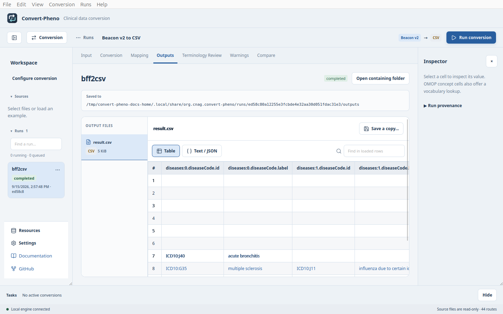
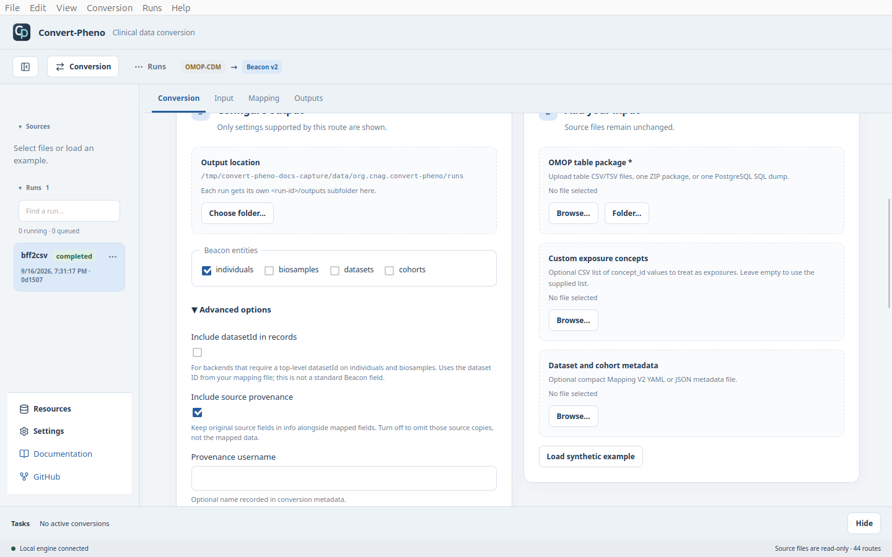
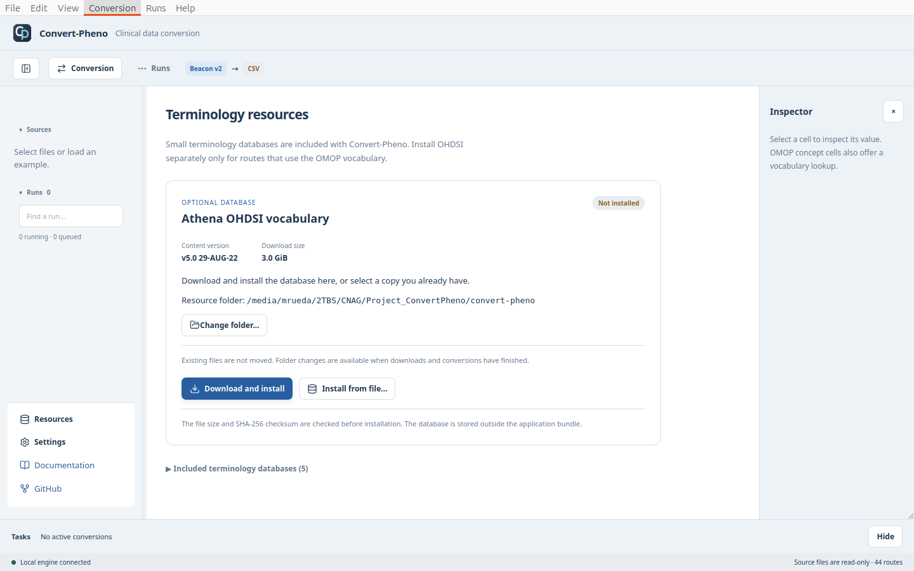
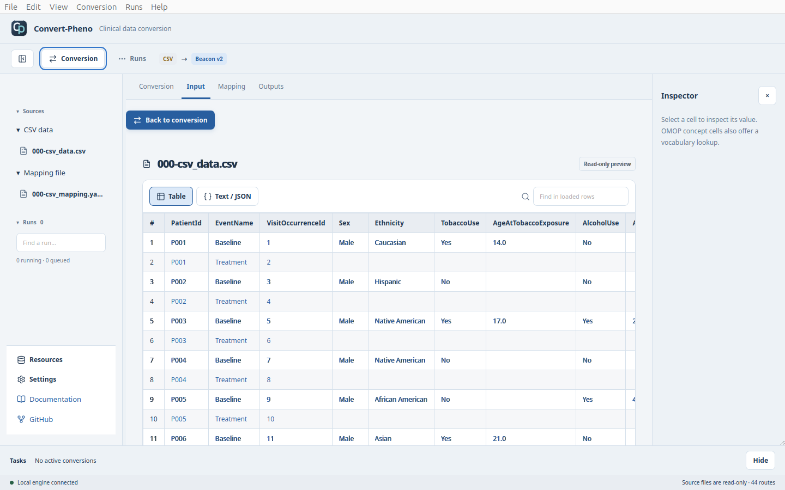
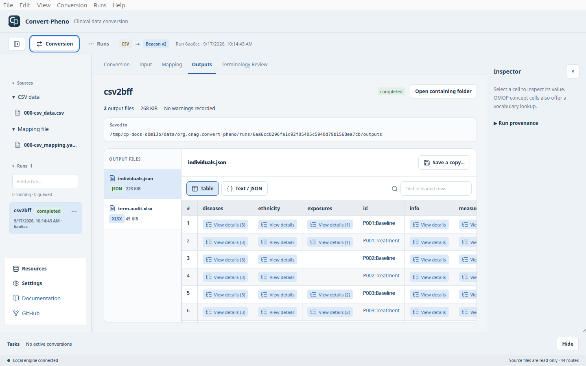
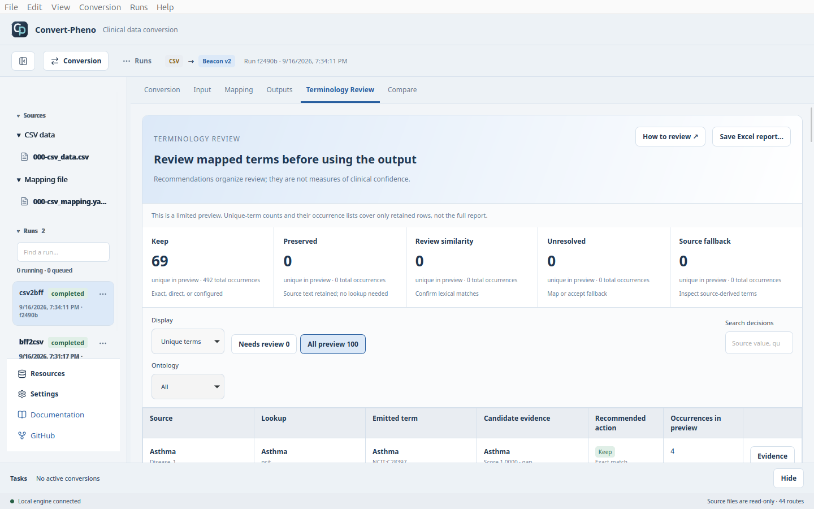

Convert files locally with the **same core engine as the CLI**. Available from
Convert-Pheno 0.35. Participant data stays on your computer.

See [Video Tutorials](video-tutorials) for demonstrations with synthetic data.

## Install

Download the installer for your operating system and processor from
[GitHub Releases](https://github.com/CNAG-Biomedical-Informatics/convert-pheno/releases).
The engine and runtime are included; no separate CPAN or Node.js installation is needed.

<details>
<summary>macOS installation</summary>

Choose the Apple Silicon or Intel DMG to match **About This Mac**. Drag
**Convert-Pheno** into **Applications**, then launch it there.

:::warning[First launch on macOS]
The macOS build is not Apple-notarized. If macOS blocks its first launch, open
**System Settings > Privacy & Security** and approve the application using
**Open Anyway** after attempting to open it.
:::

</details>

<details>
<summary>Linux installation and compatibility</summary>

Choose `linux-x86_64` for Intel/AMD or `linux-aarch64` for ARM64. For example:

```bash
chmod +x convert-pheno-linux-x86_64.AppImage
./convert-pheno-linux-x86_64.AppImage
```

:::warning[Older Linux systems]
Build baselines are Ubuntu 22.04 for x86_64 and Ubuntu 24.04 for ARM64.
AppImages still depend on the host's glibc. If an older installation reports
`GLIBC_x.xx not found`, use a compatible OS or the
[containerized CLI](download-and-installation/docker-based).
Do not replace system glibc manually.
:::

</details>

<details>
<summary>Windows installation</summary>

Download and run `convert-pheno-windows-x86_64-setup.exe`,
then open Convert-Pheno from the Start menu. An unsigned installer may trigger
SmartScreen; check the download source before selecting **More info > Run anyway**.

</details>

## First conversion

1. Choose **Beacon v2** as the source and **CSV** as the target.
2. Select **Load synthetic example**. Required example files load together.
3. Inspect the input, then select the blue **Back to conversion** button.
4. Check the output folder and select **Run conversion**.
5. Inspect **Outputs**. Use **Save a copy...** or **Open containing folder**.



## Projects

Use **File > Save Project** and **Open Project...** to keep and reopen a setup.
Keep the **`.cpheno` file and `.cpheno.data` folder together**. Examples, pasted
JSON, and edited mappings are preserved; external inputs are referenced, not
duplicated. Locate them again if they move.

The project name appears in the window title; `*` marks unsaved changes.
Opening or closing a project prompts you to save or discard changes.

## Conversion options

Open **Advanced options** under **Configure output**. Only settings relevant
to your route appear.

**Converting OMOP to Beacon with a dataset ID?** Load the
[small metadata mapping](mapping-files#compact-dataset-and-cohort-metadata) under
**Dataset and cohort metadata**. Enable **Include datasetId in records** only
when your backend also requires that field on individuals and biosamples.

<details>
<summary>Provenance, datasetId, terminology, and OMOP settings</summary>

| Setting | Purpose |
| --- | --- |
| **Include source provenance** | Keep or omit original source-field copies in `info`; mapped fields remain |
| **Include datasetId in records** | Copy `beacon.datasets.defaults.id` to individuals and biosamples for backends requiring this non-standard extension; off by default |
| **Default vital status** | PXF status used when the source has none |
| **Terminology search** | Exact, mixed, or fuzzy; similarity controls appear for mixed/fuzzy |
| **OMOP processing limit** | Limit participants in non-streaming processing and rows per table in SQL imports; `0` means unlimited |
| **OMOP input tables** | Choose tables, or leave empty for all supported tables |
| **Use installed OHDSI vocabulary** | Use the installed database instead of the input CONCEPT table |
| **Stream OMOP input** | Reduce memory use and write line-delimited JSON for supported BFF entities |

OMOP also accepts a **Custom exposure concepts** file; otherwise the supplied
list is used. See [Mapping Files](mapping-files#compact-dataset-and-cohort-metadata)
for dataset metadata and [Terminology Search](terminology-search) for matching.



</details>

## Output folders and run history

:::info[Background conversions, including long-running jobs]
Conversions run **asynchronously**, so you can continue using the app while a
job processes your data. Follow its status in **Runs**, inspect earlier results,
or queue another conversion. By default, jobs execute **one at a time**. In
**Settings → Maximum concurrent jobs**, you can allow more conversions to run
simultaneously. Each conversion generally uses one CPU core, and running more
jobs is limited to the detected logical CPU count (up to 16). Running more
jobs also needs more memory; this setting does not reserve CPU cores.
Lowering the limit lets active jobs finish before starting more queued work.
**Keep the app open** until your jobs finish.
:::

Each run writes to its own folder.

Use a run's three-dot menu to cancel it, **Delete from history** (keep files),
or **Delete run and output files**. The **Runs** menu offers bulk deletion.
These actions never delete original inputs.

## Inspecting output

Switch between **Table** and **Text / JSON**. Select **View details** for nested
values; copy icons copy displayed text. OMOP concept-ID cells offer a read-only
lookup in the installed OHDSI database.

**Compare** shows run settings, output filenames, and audit counts, not
record-by-record differences. Resize or collapse the left navigation as needed;
choose light/dark themes in **Settings**.

## OHDSI terminology database

In **Resources**, choose the resource folder, then **Download and install**.
The app downloads, verifies, and installs `ohdsi.db`. Keep it open until finished.
Already have the file? Use **Install from file**.



The folder is remembered. Changing it does not move existing files; wait for
active downloads and conversions to finish first.

## Terminology review

Enable **Create terminology audit** before converting. It is **off by default**
and adds processing time. Open **Terminology Review** on the completed run;
**Unique terms** groups repeated decisions across individuals.

<details>
<summary>Example: CSV input, Beacon output, and terminology review</summary>

Choose **CSV → Beacon v2** and **Load synthetic example**. The example loads
both the data and its mapping. Select the CSV under **Sources** to inspect it:



Select **Back to conversion**, enable **Create terminology audit**, then run.
**Outputs** contains the converted individuals and the Excel report:



Open **Terminology Review** to inspect the lookup decisions. **Unique terms**
groups repeated decisions; the complete report retains all occurrences.



</details>

The preview is limited. **Save Excel report...** exports the complete report.
For mapping corrections, edit **Mapping**, select **Validate and use copy**,
then rerun. **Save as...** saves the edited mapping separately.

<details>
<summary>What do Fallback, Unresolved, and Preserved mean?</summary>

- **Source fallback:** a source-derived term was retained without a lookup.
- **Unresolved:** a lookup found no accepted match; review the fallback or mapping.
- **Preserved:** source text was deliberately retained without needing a lookup.

For example, geographic origin is not an OMOP ethnicity concept. An OMOP concept
ID of `0` alone does not prove a failed search.
See [Terminology Search](terminology-search) for decision details.

</details>

<details>
<summary>Reporting a problem</summary>

Include the app version, operating system, processor, failed step, and error.
Try a synthetic example first. Do not attach participant data or screenshots
containing sensitive records.

</details>

<details>
<summary>Development: run from source</summary>

With Node.js 24, Rust 1.86, Tauri's platform libraries, Perl, and Convert-Pheno's
dependencies installed:

```bash
cd app
npm ci
npm run desktop
```

</details>

The [original Web App](https://convert-pheno.cnag.cat/) is a legacy demonstration,
not this desktop application, and does not reflect current conversion support.
