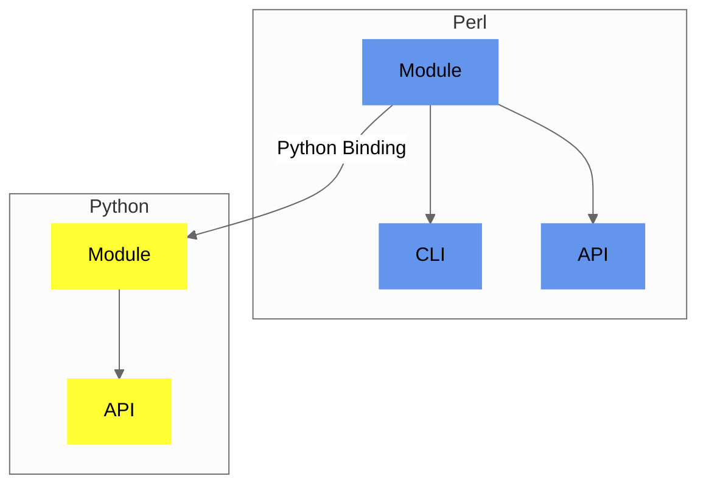

## Components

`Convert-Pheno` exposes several interfaces around one conversion implementation. The [CLI](use-as-a-command-line-interface), [Perl module](use-as-a-module), and Perl HTTP(s) API call the core in-process. The Python binding serializes requests through a small JSON subprocess bridge; the Python HTTP(s) API uses that same binding. Mapping and conversion behavior therefore remain in the Perl core rather than being reimplemented by each interface.

<figcaption>Diagram showing Convert-Pheno implementation</figcaption>

:::tip[Which one should I use?]
Most users should start with the [CLI](use-as-a-command-line-interface). The [module](use-as-a-module) and [HTTP(s) APIs](use-as-an-api) are intended for developers embedding conversions in other software.

:::
:::note[API scope]
The HTTP(s) API is primarily intended for **self-contained JSON conversions** such as `BFF`, `PXF`, FHIR R4 Bundles, and carefully prepared `OMOP-CDM` payloads.

Mapping-file-based routes such as `CSV`, `REDCap`, and `CDISC-ODM` are still better handled through the CLI, because they depend on extra file artifacts rather than on one clean request payload. REDCap and REDCap-origin ODM also use an external dictionary; generic ODM resolves embedded metadata. Multi-file Dataset-JSON and Dataset-XML plus Define-XML input are likewise available through the CLI or local module rather than the HTTP(s) API.

:::
## Software architecture

All interfaces use the same conversion core. A shared route list keeps the CLI,
Perl module, Python binding, and HTTP(s) APIs aligned on which conversions are
available.

A conversion follows four main steps:

1. **Select the route.** The requested input and output determine which
   conversion steps are needed.
2. **Read the source.** Format-specific readers handle files, tables,
   references, and participant grouping.
3. **Transform the records.** Most multi-step routes first create BFF and then
   continue to the requested output, such as PXF or OMOP-CDM. Simpler routes
   can convert directly.
4. **Return or write the result.** Module and API calls return data in memory;
   the CLI writes the selected files.

For BFF output, `-obff FILE` writes one `individuals` collection. Use
`-obff --entities ... --out-dir ...` when separate `individuals`, `biosamples`,
`datasets`, or `cohorts` files are needed.

File output is staged before replacing an existing destination, reducing the
risk of leaving a partial file after an error. Large supported OMOP input
routes can also use streaming to limit memory use.
