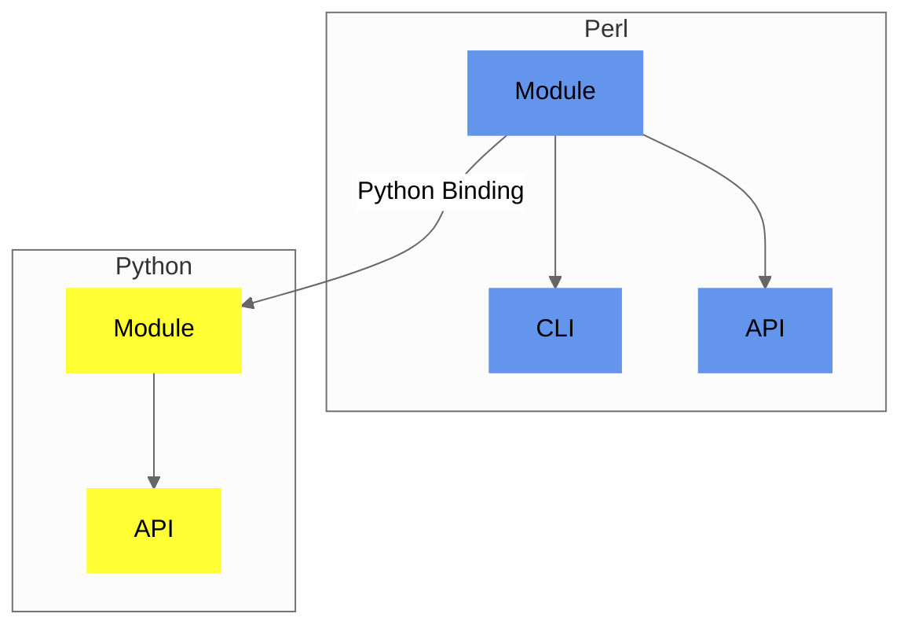

## Components

`Convert-Pheno` exposes several interfaces around one conversion implementation. The [CLI](use-as-a-command-line-interface), [Perl module](use-as-a-module), and Mojolicious HTTP(s) API call the Perl core. The native [desktop application](graphical-interface), available from Convert-Pheno 0.35, starts a private loopback instance of that API and a local worker queue. The Python binding reaches the same core through a small JSON subprocess bridge. Mapping and conversion behavior are therefore not reimplemented by each interface.

<figcaption>Diagram showing Convert-Pheno implementation</figcaption>

:::tip[Which one should I use?]
Most users should start with the [CLI](use-as-a-command-line-interface). From version 0.35, the [desktop application](graphical-interface) provides a native interface for interactive conversions. The [module](use-as-a-module) and [HTTP(s) APIs](use-as-an-api) are intended for developers embedding conversions in other software.

:::
:::note[API scope]
The Mojolicious HTTP(s) API accepts both self-contained JSON and registry-defined multipart uploads and is the supported server for new integrations. The smaller FastAPI reference server intentionally exposes only JSON-capable routes and is retained temporarily before future deprecation. This does not affect the Python module binding. Streaming and large inputs remain CLI or module workflows.

:::
## Software architecture

All interfaces use the same conversion core. A shared route registry keeps the
CLI, Perl module, Python binding, Mojolicious API, and desktop application aligned on which
conversions are available. The desktop application reads the public portion of this
registry instead of maintaining a separate conversion matrix.

A conversion follows four main steps:

1. **Select the route.** The requested input and output determine which
   conversion steps are needed.
2. **Read the source.** Format-specific readers handle files, tables,
   references, and participant grouping.
3. **Transform the records.** Most multi-step routes first create BFF and then
   continue to the requested output, such as PXF or OMOP-CDM. Simpler routes
   can convert directly.
4. **Return or write the result.** The CLI writes the selected files. Module
   calls return data in memory, while the API and desktop application package generated
   files for preview or download.

For BFF output, `-obff FILE` writes one `individuals` collection. Use
`-obff --entities ... --out-dir ...` when separate `individuals`, `biosamples`,
`datasets`, or `cohorts` files are needed.

File output is staged before replacing an existing destination, reducing the
risk of leaving a partial file after an error. Large supported OMOP input
routes can also use streaming to limit memory use.
