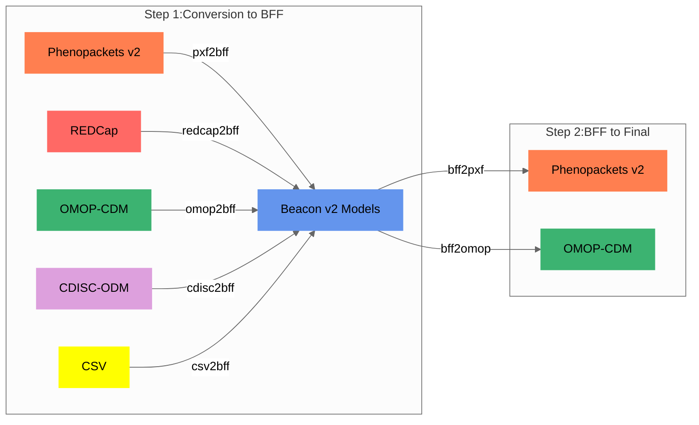

import Tabs from '@theme/Tabs';
import TabItem from '@theme/TabItem';

## At a Glance

Most conversions use `BFF` as the center model:

| Step | What Happens | Why It Matters |
|------|--------------|----------------|
| 1 | Source data is normalized into Beacon v2 Models / BFF | This gives the software one consistent internal target |
| 2 | BFF is optionally converted into the requested final model | This enables `PXF` and `OMOP-CDM` output without rewriting every source route |
| 3 | Unmapped source values are preserved when useful | Users can audit the conversion and query source-specific fields later |

:::tip[Practical shortcut]
If you only need commands, use [Conversion Recipes](conversion-recipes). Use this page when you want to understand why mappings are structured the way they are.
:::

## Step 1: Conversion to the target model

For **most workflows**, `Convert-Pheno` first maps the input data to [BFF](bff), the Beacon v2 Models-based format that acts as the **internal target** or **center model** of the toolkit. From there, the data can remain as `BFF` or continue to other outputs such as `PXF` or `OMOP CDM`.


<figcaption>Convert-Pheno internal mapping steps</figcaption>

<details>
<summary>Why use Beacon v2 Models as the target model?</summary>

* **JSON Schema Utilization:** Beacon v2 employs [JSON Schema](https://github.com/ga4gh-beacon/beacon-v2/tree/main/models) for model content definition, facilitating transparency and accessibility in a collaborative environment compared to Phenopackets' Protobuf usage.
* **Accommodation of Additional Properties:** The Beacon v2 Models schema permits additional properties, enhancing adaptability and enabling near-lossless conversion, especially when using JSON in non-relational databases.
* **Beacon v2 API Compatibility:** The BFF is directly compatible with the Beacon v2 API ecosystem, a feature not available in Phenopackets without additional mapping.
* **Expansion Possibility:** Being based at CNAG, a genomics institution, the potential to extend Convert-Pheno's mapping to encompass other Beacon v2 entities was a significant consideration.
* **Overlap with Phenopackets v2:** Despite minor differences in nomenclature or hierarchy, many essential terms remain identical, encouraging interoperability.

</details>
<details>
<summary>Advanced mapping details, ontology preservation, and search behavior</summary>

### Schema mapping

When starting a new conversion between two data models, the first step is to **map variables** between the two data schemas.

Starting with **version 0.31**, the mapping is no longer carried out only by **human brains** :cold_sweat:. `Convert-Pheno` can also rely on **`gpt-5.4`** with **`high`** reasoning when needed.

<details>
<summary>Mapping strategy: External or hardcoded?</summary>

In the early stages of development, we explored the possibility of employing configuration files to guide the mapping process as an alternative to hardcoded solutions. However, JSON data structures' complexity, mainly due to nesting, made this approach impractical for most scenarios, except for [REDCap](redcap) and [CDISC-ODM](cdisc-odm) data, which are mapped to Beacon v2 Models via configuration files.

</details>
In the **Mapping tables** section (accessible via the 'Technical Details' tab on the left navigation bar), we outline the equivalencies between different schemas. These tables fulfill several purposes:

1. It's a quick way to help out the _Health Data_ community.
2. Experts can check it out and suggest changes without digging into all the code.
3. If you want to chip in and create a new conversion, you can start by making a mapping table.

:::danger[Notice]
Please note that accurately mapping, even between two standards, is a substantial undertaking. While we possess expertise in certain areas, we certainly don't claim mastery in all :pray:. We sincerely welcome any **suggestions** or feedback.

:::
<details>
<summary>Contributing</summary>

While creating the code for a new format can be challenging, modifying properties in an existing one is much easier. Feel free to [reach us](https://github.com/CNAG-Biomedical-Informatics/convert-pheno/issues) should you plan to contribute.


</details>
### From table mappings to code

These tables serve as a **reference** for implementing Convert-Pheno's source code. Each format conversion has a dedicated Perl [submodule](https://github.com/CNAG-Biomedical-Informatics/convert-pheno/tree/main/lib/Convert/Pheno), and during implementation we verify that the converted output conforms to the final target data schema.

### Lossless or lossy conversion?

When converting data from one data standard to another, it is important to consider the possibility of losing information due to differences in schema and field mapping. To mitigate this, we aimed for a **lossless** conversion by incorporating non-mappable variables as `additionalProperties` within the Beacon v2 Models [schema](https://docs.genomebeacons.org/schemas-md/individuals_defaultSchema/). This allows users to access the original variables and their values through database queries, especially when using non-relational databases like MongoDB. 

During the conversion process, handling variables that cannot be directly mapped can result in one of two scenarios:


<Tabs>
<TabItem value="unmappable-variables" label="Unmappable variables">


Often, the input data model has variables that do not directly map to the target but are still useful to retain in the output format. If the target format allows for extra properties in a given term (as BFF does), these original variables are stored under the `_info` property (or `_` + ‘property name’). This commonly happens in conversions from OMOP CDM to BFF. 

Example extracted from `omop2bff` [conversion](https://github.com/CNAG-Biomedical-Informatics/convert-pheno/blob/main/t/omop2bff/out/individuals.json):
 
<details>
<summary>See example</summary>

```json
        "interventionsOrProcedures" : [
               {
                  "_info" : {
                     "PROCEDURE_OCCURRENCE" : {
                        "OMOP_columns" : {
                           "modifier_concept_id" : 0,
                           "modifier_source_value" : null,
                           "person_id" : 2,
                           "procedure_concept_id" : 4163872,
                           "procedure_date" : "1955-10-22",
                           "procedure_datetime" : "1955-10-22 00:00:00",
                           "procedure_occurrence_id" : 6,
                           "procedure_source_concept_id" : 4163872,
                           "procedure_source_value" : 399208008,
                           "procedure_type_concept_id" : 38000275,
                           "provider_id" : "\\N",
                           "quantity" : "\\N", 
                           "visit_detail_id" : 0,
                           "visit_occurrence_id" : 103
                        }
                     }
                  },
                  "ageAtProcedure" : {
                     "age" : {
                        "iso8601duration" : "35Y"
                     }
                  },
                  "dateOfProcedure" : "1955-10-22",
                  "procedureCode" : {
                     "id" : "SNOMED:399208008",
                     "label" : "Plain chest X-ray"
                  }
               }
         ]
        ```

</details>
Example extracted from `redcap2bff` [conversion](https://github.com/CNAG-Biomedical-Informatics/convert-pheno/blob/main/t/redcap2bff/out/individuals.json):

<details>
<summary>See example</summary>

```json
        "treatments" : [
               {
                  "_info" : {
                     "dose" : null,
                     "drug" : "budesonide",
                     "drug_name" : "budesonide",
                     "duration" : null,
                     "field" : "budesonide_oral_status",
                     "route" : "oral",
                     "start" : null,
                     "status" : "never treated",
                     "value" : 1
                  },
                  "doseIntervals" : [],
                  "routeOfAdministration" : {
                     "id" : "NCIT:C38288",
                     "label" : "Oral Route of Administration"
                  },
                  "treatmentCode" : {
                     "id" : "NCIT:C1027",
                     "label" : "Budesonide"
                  }
               }
        ]
        ```

</details>
Example of longitudinal data stored under `_visit` in a `omop2bff` [conversion](https://github.com/CNAG-Biomedical-Informatics/convert-pheno/blob/main/t/omop2bff/out/individuals.json):

<details>
<summary>See example</summary>

```json
        "_visit" : {
                "_info" : {
                   "VISIT_OCCURRENCE" : {
                      "OMOP_columns" : {
                         "admitting_source_concept_id" : 0,
                         "admitting_source_value" : null,
                         "care_site_id" : "\\N",
                         "discharge_to_concept_id" : 0,
                         "discharge_to_source_value" : null,
                         "person_id" : 3,
                         "preceding_visit_occurrence_id" : 347,
                         "provider_id" : "\\N",
                         "visit_concept_id" : 9201,
                         "visit_end_date" : "1972-12-21",
                         "visit_end_datetime" : "1972-12-21 00:00:00",
                         "visit_occurrence_id" : 312,
                         "visit_source_concept_id" : 0,
                         "visit_source_value" : "5d035dd1-30d9-4389-b94c-64947bf1f18c",
                         "visit_start_date" : "1972-12-20",
                         "visit_start_datetime" : "1972-12-20 00:00:00",
                         "visit_type_concept_id" : 44818517
                      }
                   }
                },
                "concept" : {
                   "id" : "Visit:IP",
                   "label" : "Inpatient Visit"
                },
                "end_date" : "1972-12-21T00:00:00Z",
                "id" : "312",
                "occurrence_id" : 312,
                "start_date" : "1972-12-20T00:00:00Z",
                "type" : {
                   "id" : "Visit_Type:OMOP4822465",
                   "label" : "Visit derived from encounter on claim"
                }
             },
             "featureType" : {
                "id" : "SNOMED:428251008",
                "label" : "History of appendectomy"
             },
             "onset" : {
                "iso8601duration" : "56Y"
             }
        }
        ```

</details>

</TabItem>
<TabItem value="match-to-a-different-entity" label="Match to a different entity">


When a variable corresponds to a different entity in [Beacon v2 Models](https://github.com/ga4gh-beacon/beacon-v2), `Convert-Pheno` tries to preserve that information without dropping it. In the `individuals`-based output path used **before version 0.30**, this often means storing the data inside the `info` term of the [individuals](https://docs.genomebeacons.org/schemas-md/individuals_defaultSchema/) entity. For instance, a `PXF` file may contain the [biosamples](https://phenopacket-schema.readthedocs.io/en/latest/phenopacket.html) property, which does not belong to the Beacon [individuals](https://docs.genomebeacons.org/schemas-md/individuals_defaultSchema/) entity but to the Beacon [biosamples](https://docs.genomebeacons.org/schemas-md/biosamples_defaultSchema/) entity. In that path, the data are preserved under `info.phenopacket.biosamples`.

Starting with **version 0.30**, newer internal bundle-based paths can already expose `biosamples` as a **separate output entity** for `PXF`, while keeping the earlier `individuals` behaviour for backward compatibility.
 
Example extracted from the `pxf2bff` [conversion](https://github.com/CNAG-Biomedical-Informatics/convert-pheno/blob/main/t/pxf2bff/out/individuals.json), using the `individuals`-based output path kept for backward compatibility:
 
<details>
<summary>See example</summary>

```json
        "info" : {
                  "phenopacket" : {
                     "biosamples" : [
                        {
                           "id" : "biosample.1",
                           "phenotypicFeatures" : [
                              {
                                 "excluded" : false,
                                 "type" : {
                                    "id" : "HP:0003798",
                                    "label" : "Nemaline bodies"
                                 }
                              }
                           ],
                           "procedure" : {
                              "bodySite" : {
                                 "id" : "UBERON:0002378",
                                 "label" : "muscle of abdomen"
                              },
                              "code" : {
                                 "id" : "NCIT:C51895",
                                 "label" : "Muscle Biopsy"
                              },
                              "performed" : {
                                 "age" : {
                                    "iso8601duration" : "P1D"
                                 }
                              }
                           },
                           "sampledTissue" : {
                              "id" : "UBERON:0002378",
                              "label" : "muscle of abdomen"
                           }
                        }
                     ]
               }
        }
        ```

</details>

</TabItem>
</Tabs>
### Preservation and augmentation of ontologies

One of the advantages of **Beacon/Phenopackets v2** is that they **do not prescribe the use of specific ontologies**, thus allowing us to retain the original ontologies, except to fill in missing terms in required fields.

<details>
<summary>Which ontologies/terminologies are supported?</summary>

 
If the input files contain ontology terms, the **ontologies will be preserved** and remain intact after the conversion process, except for:
 
* _Beacon v2 Models_ and _Phenopackets v2_: the property `sex` is converted to [NCI Thesaurus](https://ncithesaurus.nci.nih.gov/ncitbrowser) via database search.
* _OMOP CDM_: the properties `sex`, `ethnicity`, and `geographicOrigin` are converted to [NCI Thesaurus](https://ncithesaurus.nci.nih.gov/ncitbrowser) via database search.

|                | CSV |  REDCap      | CDISC-ODM  | OMOP-CDM | Phenopackets v2| Beacon v2 Models |
| -----------    | ----|-------       | ---------- | -------  | -------------- | -----------------|
| Data mapping   | ✓   | ✓ | ✓ | ✓ | ✓ | ✓ |
| Add ontologies | ✓   | ✓ | ✓ | `--ohdsi-db` |     |                  |

**Database Search Feature**
   
For input types that do not contain ontologies, such as `CSV`, _REDCap_, and _CDISC-ODM_, we perform a **database search** to fetch ontologies from a variety of trusted databases. Supported databases include:
  
* [Athena-OHDSI](https://athena.ohdsi.org/search-terms/start) standardized vocabulary, which includes multiple terminologies, such as _SNOMED, RxNorm or LOINC_
* [NCI Thesaurus](https://ncithesaurus.nci.nih.gov/ncitbrowser)
* [ICD-10](https://icd.who.int/browse10) terminology
* [CDISC](https://www.cdisc.org/standards/terminology/controlled-terminology) (Study Data Tabulation Model Terminology)
* [OMIM](https://www.omim.org/) Online Mendelian Inheritance in Man
* [HPO](https://hpo.jax.org/app) Human Phenotype Ontology (Note that prefixes are `HP:`, without the `O`)

</details>
<details>
<summary>About text similarity in database searches</summary>


`Convert-Pheno` comes with several pre-configured ontology/terminology databases. It supports three types of label-based search strategies:

---

#### 1. `exact` (default)

Returns only **exact matches** for the given label string. If the label is not found exactly, no results are returned.

---

#### 2. `mixed` (use `--search mixed`)

**Hybrid search**: First tries to find an exact label match. If none is found, it performs a token-based similarity search and returns the closest matching concept based on the **highest similarity score**.

---

#### 3. ✨ `fuzzy` (use `--search fuzzy`)

**Hybrid search with fuzzy ranking**:  
Like `mixed`, it starts with an exact match attempt. If that fails, it performs a **weighted similarity search**, where:
- **90%** of the score comes from token-based similarity (e.g., cosine or Dice coefficient),
- **10%** comes from the **normalized Levenshtein similarity**.

The concept with the highest composite score is returned.

**Note:** The normalized Levenshtein similarity is computed on top of the candidate results produced by the full text search. In this approach, an initial full text search (using token-based methods) returns a set of potential matches. The fuzzy search then refines these results by applying the normalized Levenshtein distance to better handle minor typographical differences, ensuring that the final composite score reflects both overall token similarity and fine-grained character-level differences.


---

#### 🔍 Example Search Behavior

**Query:** `Exercise pain management`  
- With `--search exact`: ✅ Match found — **Exercise Pain Management**

**Query:** `Brain Hemorrhage`  
- With `--search mixed`:  
  - ❌ No exact match  
  - ✅ Closest match by similarity: **Intraventricular Brain Hemorrhage**

---

### 💡 Similarity Threshold

The `--min-text-similarity-score` option sets the minimum threshold for `mixed` and `fuzzy` searches.
- Default: `0.8` (conservative)  
- Lowering the threshold may increase recall but may introduce irrelevant matches.

---

### ⚠️ Performance Note

Both `mixed` and `fuzzy` modes are more computationally intensive and can produce unexpected or less interpretable matches. Use them with care, especially on large datasets.

---

### 🧪 Example Results Table

Below is an example showing how the query `Sudden Death Syndrome` performs using different search modes against the NCIt ontology:

| Query                 | Search | NCIt match (label)                                    | NCIt code    | Cosine | Dice | Levenshtein (Normalized) | Composite |
|-----------------------|--------|-------------------------------------------------------|--------------|--------|------|--------------------------|-----------|
| Sudden Death Syndrome | exact  | NA                                                    | NA           | NA     | NA   | NA                       | NA        |
|                       | mixed  | CDISC SDTM Sudden Death Syndrome Type Terminology     | NCIT:C101852 | 0.65   | 0.60 | NA                       | NA        |
|                       |        | Family History of Sudden Arrythmia Death Syndrome     | NCIT:C168019 | 0.65   | 0.60 | NA                       | NA        |
|                       |        | Family History of Sudden Infant Death Syndrome        | NCIT:C168209 | 0.65   | 0.60 | NA                       | NA        |
|                       |        | Sudden Infant Death Syndrome                          | NCIT:C85173  | 0.86   | 0.86 | NA                       | NA        |
|                       | ✨ fuzzy  | CDISC SDTM Sudden Death Syndrome Type Terminology     | NCIT:C101852 | 0.65   | 0.60 | 0.43                     | 0.63      |
|                       |        | Family History of Sudden Arrythmia Death Syndrome     | NCIT:C168019 | 0.65   | 0.60 | 0.43                     | 0.63      |
|                       |        | Family History of Sudden Infant Death Syndrome        | NCIT:C168209 | 0.65   | 0.60 | 0.46                     | 0.63      |
|                       |        | Sudden Infant Death Syndrome                          | NCIT:C85173  | 0.86   | 0.86 | 0.75                     | 0.85      |

**Interpretation:**  

- With `exact`, there are no matches.

- With `mixed`, the best match will be `Sudden Infant Death Syndrome`.

- With `fuzzy`, the **composite score** (90% token-based + 10% Levenshtein similarity) is used to rank results.  
  The highest match is `Sudden Infant Death Syndrome`, with a composite score of **0.85**.

---

✨ Now we introduce a typo on the query `Sudden Infant Deth Syndrome`:


| Query                 | Mode  | Candidate Label                                       | Code         | Cosine | Dice   |  Levenshtein (Normalized) | Composite |
|-----------------------|-------|-------------------------------------------------------|-------------|--------|--------|------------|-----------|
| Sudden Infant Deth Syndrome | fuzzy | CDISC SDTM Sudden Death Syndrome Type Terminology     | NCIT:C101852 | 0.38   | 0.36   | 0.33        | 0.37      |
|                             |       | Family History of Sudden Arrythmia Death Syndrome     | NCIT:C168019 | 0.38   | 0.36   | 0.43        | 0.38      |
|                             |       | Family History of Sudden Infant Death Syndrome        | NCIT:C168209 | 0.57   | 0.55   | 0.59        | 0.57      |
|                             |       | Sudden Infant Death Syndrome                          | NCIT:C85173 | 0.75   | 0.75   | 0.96        | 0.77      

To capture the best match we would need to lower the threshold to  `--min-text-similarity-score 0.75`

It is possible to change the weight of Levenshtein similarity via `--levenshtein-weight <floating 0.0 - 1.0>`.


</details>
<details>
<summary>Composite Similarity Score</summary>


The composite similarity score is computed as a weighted sum of two measures: the token-based similarity and the normalized Levenshtein similarity.

#### 1. Token-Based Similarity

This is calculated using methods like cosine or Dice similarity to measure how similar the tokens (words) of two strings are.

#### 2. Normalized Levenshtein Similarity

The normalized Levenshtein similarity is defined as:

```text
\text{NormalizedLevenshtein}(s_1, s_2) = 1 - \frac{\text{lev}(s_1, s_2)}{\max(|s_1|, |s_2|)}
```

Where:
- `\text{lev}(s_1, s_2)` is the Levenshtein edit distance—the minimum number of insertions, deletions, or substitutions required to change `s_1` into `s_2`.
- `|s_1|` and `|s_2|` are the lengths of the strings `s_1` and `s_2`, respectively.

This formula produces a score between 0 and 1, with **1.0** meaning identical strings and **0.0** meaning completely different strings.

#### 3. Composite Score Formula

The final composite similarity score `C` is a weighted combination of the two metrics:

```text
C(s_1, s_2) = \alpha \cdot \text{TokenSimilarity}(s_1, s_2) + \beta \cdot \text{NormalizedLevenshtein}(s_1, s_2)
```

Where:
- `\alpha` (or `token_weight`) is the weight assigned to the token-based similarity.
- `\beta` (or `lev_weight`) is the weight assigned to the normalized Levenshtein similarity.

A common default is to set `\alpha = 0.9` and `\beta = 0.1`, emphasizing the token-based similarity. However, for short strings (4–5 words), you might consider adjusting the balance (for example, `\alpha = 0.95` and `\beta = 0.05`) if small typographical differences are less critical.

</details>

</details>
## Step 2: Conversion to the final model

:::tip[Data validation]

To ensure the integrity and validity of converted outputs, we employ **external validation tools during development and in unit tests**. Specifically, we used the [bff-tools validate](https://github.com/CNAG-Biomedical-Informatics/beacon2-cbi-tools?tab=readme-ov-file#bff-tools-script-binbff-tools) for Beacon Friendly Format (BFF) and [phenopacket-tools](http://phenopackets.org/phenopacket-tools/stable) for Phenotype Exchange Format (PXF). These validators were instrumental in ensuring converted data adhere to the respective schemas and standards; for example, conversions were validated until the output was 100% compliant with the target schema. The same validation process is applied to Beacon v2 and OMOP CDM outputs. By preserving non-mapped variables where appropriate and applying rigorous validation, we aim to mitigate information loss and maximise fidelity of the converted data.

**Important:** Convert-Pheno **does not validate your input data**. Input validation is out of scope for the software. If fields are missing or malformed, Convert-Pheno will handle these cases internally and apply default values where appropriate, but it will not verify that your source files are complete or correct. We therefore recommend validating and cleaning source files before conversion.

See:

* [bff-tools validate](https://github.com/CNAG-Biomedical-Informatics/beacon2-cbi-tools?tab=readme-ov-file#bff-tools-script-binbff-tools)
* [phenopacket-tools](http://phenopackets.org/phenopacket-tools/stable)
* [OMOP CSV Validator](https://github.com/CNAG-Biomedical-Informatics/omop-csv-validator)

:::
### To Phenopackets 

If the output is set to [Phenopackets v2](pxf) then a second step (`bff2pxf`) is performed (see diagram above).

<details>
<summary>BFF and PXF community alignment</summary>

At present, we have prioritized mapping the terms that we deem most critical in facilitating **basic semantic interoperability**. We anticipate that Beacon v2 Models will become more aligned with Phenopackets v2, which will simplify the conversion process in future updates. We aim to refine the mappings in future iterations, with the community providing a wider range of case studies.

</details>
### To OMOP CDM

If the output is set to [OMOP CDM](omop-cdm) then a second step (`bff2omop`) is performed (see diagram above).
