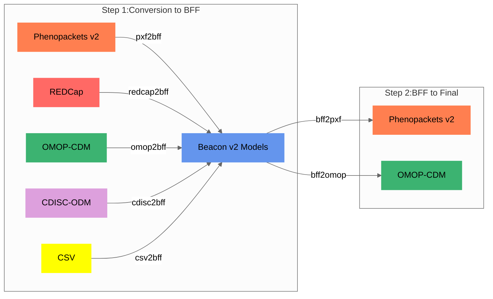

import Tabs from '@theme/Tabs';
import TabItem from '@theme/TabItem';

## At a Glance

Most conversions use `BFF` as the internal target model:

| Step | What Happens | Why It Matters |
|------|--------------|----------------|
| 1 | Source data is normalized into Beacon v2 Models / BFF | This gives the software one consistent target |
| 2 | BFF is optionally converted into the requested final model | This keeps source-specific parsing separate from final-output serialization |
| 3 | Unmapped source values are preserved when useful | Users can audit the conversion and query source-specific fields later |

:::tip[Practical shortcut]
If you only need commands, use [Conversion Recipes](conversion-recipes). Use this page when you want to understand why mappings are structured the way they are.
:::

## Step 1: Conversion to the target model

For **most routes**, `Convert-Pheno` first maps the input data to [BFF](bff), the Beacon v2 Models-based format that acts as the **internal target model**. From there, the data can remain as `BFF` or continue to other outputs such as `PXF` or `OMOP CDM`.


<figcaption>Convert-Pheno internal mapping steps</figcaption>

<details>
<summary>Why use Beacon v2 Models as the target model?</summary>

* **JSON Schema:** Beacon v2 Models are defined with [JSON Schema](https://github.com/ga4gh-beacon/beacon-v2/tree/main/models), which is useful for validation and inspection.
* **Additional properties:** The Beacon v2 Models schema allows additional properties, which helps preserve source values that do not have a first-class target field.
* **Beacon v2 API alignment:** BFF follows the data shape expected by Beacon v2-oriented deployments.
* **Multi-entity output:** Beacon v2 Models provide entities beyond `individuals`, including `biosamples`, `datasets`, and `cohorts`.
* **Overlap with Phenopackets v2:** Several clinical and phenotypic concepts are shared or closely aligned between the models.

</details>
<details>
<summary>Advanced mapping details, ontology preservation, and search behavior</summary>

### Schema mapping

When starting a new conversion between two data models, the first step is to **map variables** between the two data schemas.

Starting with **version 0.31**, some mapping-table drafts may use LLM assistance when the source model is especially dense or ambiguous. These mappings still require human review before being treated as project documentation.

<details>
<summary>Mapping strategy: External or hardcoded?</summary>

In the early stages of development, we considered configuration files for schema-to-schema mapping. Deeply nested JSON structures made that impractical for most routes. The exception is mapping-file input such as [REDCap](redcap), [CSV](csv), and [CDISC-ODM](cdisc-odm), where source fields are project-specific and user configuration is necessary.

</details>
In the **Mapping tables** section (accessible via the 'Technical Details' tab on the left navigation bar), we outline the equivalencies between different schemas. These tables fulfill several purposes:

1. They summarize the intended mapping without requiring readers to inspect the code first.
2. Domain experts can review the mapping assumptions and suggest corrections.
3. Contributors can use them as a starting point for new conversion routes.

:::danger[Notice]
Accurately mapping between clinical data standards is a substantial task. Some mappings may need revision as new source examples and domain feedback become available.

:::
<details>
<summary>Contributing</summary>

While creating the code for a new format can be challenging, modifying properties in an existing one is much easier. Feel free to [reach us](https://github.com/CNAG-Biomedical-Informatics/convert-pheno/issues) should you plan to contribute.


</details>
### From table mappings to code

These tables serve as a **reference** for implementing Convert-Pheno's source code. Each format conversion has a dedicated Perl [submodule](https://github.com/CNAG-Biomedical-Informatics/convert-pheno/tree/main/lib/Convert/Pheno), and during implementation we verify that the converted output conforms to the final target data schema.

### Lossless or lossy conversion?

When converting data from one data standard to another, it is important to consider the possibility of losing information due to differences in schema and field mapping. To mitigate this, we aimed for a **lossless** conversion by incorporating non-mappable variables as `additionalProperties` within the Beacon v2 Models [schema](https://docs.genomebeacons.org/schemas-md/individuals_defaultSchema/). This allows users to access the original variables and their values through database queries, especially when using non-relational databases like MongoDB. 

During the conversion process, handling variables that cannot be directly mapped can result in one of two scenarios:


<Tabs>
<TabItem value="unmappable-variables" label="Unmappable variables">


Often, the input data model has variables that do not directly map to the target but are still useful to retain in the output format. If the target format allows for extra properties in a given term (as BFF does), these original variables are stored under the `_info` property (or `_` + ‘property name’). This commonly happens in conversions from OMOP CDM to BFF. 

Example extracted from `omop2bff` [conversion](https://github.com/CNAG-Biomedical-Informatics/convert-pheno/blob/main/t/omop2bff/out/individuals.json):
 
<details>
<summary>See example</summary>

```json
        "interventionsOrProcedures" : [
               {
                  "_info" : {
                     "PROCEDURE_OCCURRENCE" : {
                        "OMOP_columns" : {
                           "modifier_concept_id" : 0,
                           "modifier_source_value" : null,
                           "person_id" : 2,
                           "procedure_concept_id" : 4163872,
                           "procedure_date" : "1955-10-22",
                           "procedure_datetime" : "1955-10-22 00:00:00",
                           "procedure_occurrence_id" : 6,
                           "procedure_source_concept_id" : 4163872,
                           "procedure_source_value" : 399208008,
                           "procedure_type_concept_id" : 38000275,
                           "provider_id" : "\\N",
                           "quantity" : "\\N", 
                           "visit_detail_id" : 0,
                           "visit_occurrence_id" : 103
                        }
                     }
                  },
                  "ageAtProcedure" : {
                     "age" : {
                        "iso8601duration" : "35Y"
                     }
                  },
                  "dateOfProcedure" : "1955-10-22",
                  "procedureCode" : {
                     "id" : "SNOMED:399208008",
                     "label" : "Plain chest X-ray"
                  }
               }
         ]
        ```

</details>
Example extracted from `redcap2bff` [conversion](https://github.com/CNAG-Biomedical-Informatics/convert-pheno/blob/main/t/redcap2bff/out/individuals.json):

<details>
<summary>See example</summary>

```json
        "treatments" : [
               {
                  "_info" : {
                     "dose" : null,
                     "drug" : "budesonide",
                     "drug_name" : "budesonide",
                     "duration" : null,
                     "field" : "budesonide_oral_status",
                     "route" : "oral",
                     "start" : null,
                     "status" : "never treated",
                     "value" : 1
                  },
                  "doseIntervals" : [],
                  "routeOfAdministration" : {
                     "id" : "NCIT:C38288",
                     "label" : "Oral Route of Administration"
                  },
                  "treatmentCode" : {
                     "id" : "NCIT:C1027",
                     "label" : "Budesonide"
                  }
               }
        ]
        ```

</details>
Example of longitudinal data stored under `_visit` in a `omop2bff` [conversion](https://github.com/CNAG-Biomedical-Informatics/convert-pheno/blob/main/t/omop2bff/out/individuals.json):

<details>
<summary>See example</summary>

```json
        "_visit" : {
                "_info" : {
                   "VISIT_OCCURRENCE" : {
                      "OMOP_columns" : {
                         "admitting_source_concept_id" : 0,
                         "admitting_source_value" : null,
                         "care_site_id" : "\\N",
                         "discharge_to_concept_id" : 0,
                         "discharge_to_source_value" : null,
                         "person_id" : 3,
                         "preceding_visit_occurrence_id" : 347,
                         "provider_id" : "\\N",
                         "visit_concept_id" : 9201,
                         "visit_end_date" : "1972-12-21",
                         "visit_end_datetime" : "1972-12-21 00:00:00",
                         "visit_occurrence_id" : 312,
                         "visit_source_concept_id" : 0,
                         "visit_source_value" : "5d035dd1-30d9-4389-b94c-64947bf1f18c",
                         "visit_start_date" : "1972-12-20",
                         "visit_start_datetime" : "1972-12-20 00:00:00",
                         "visit_type_concept_id" : 44818517
                      }
                   }
                },
                "concept" : {
                   "id" : "Visit:IP",
                   "label" : "Inpatient Visit"
                },
                "end_date" : "1972-12-21T00:00:00Z",
                "id" : "312",
                "occurrence_id" : 312,
                "start_date" : "1972-12-20T00:00:00Z",
                "type" : {
                   "id" : "Visit_Type:OMOP4822465",
                   "label" : "Visit derived from encounter on claim"
                }
             },
             "featureType" : {
                "id" : "SNOMED:428251008",
                "label" : "History of appendectomy"
             },
             "onset" : {
                "iso8601duration" : "56Y"
             }
        }
        ```

</details>

</TabItem>
<TabItem value="match-to-a-different-entity" label="Match to a different entity">


When a variable corresponds to a different entity in [Beacon v2 Models](https://github.com/ga4gh-beacon/beacon-v2), `Convert-Pheno` tries to preserve that information without dropping it. In the `individuals`-based output path used **before version 0.30**, this often means storing the data inside the `info` term of the [individuals](https://docs.genomebeacons.org/schemas-md/individuals_defaultSchema/) entity. For instance, a `PXF` file may contain the [biosamples](https://phenopacket-schema.readthedocs.io/en/latest/phenopacket.html) property, which does not belong to the Beacon [individuals](https://docs.genomebeacons.org/schemas-md/individuals_defaultSchema/) entity but to the Beacon [biosamples](https://docs.genomebeacons.org/schemas-md/biosamples_defaultSchema/) entity. In that path, the data are preserved under `info.phenopacket.biosamples`.

Starting with **version 0.30**, newer internal bundle-based paths can already expose `biosamples` as a **separate output entity** for `PXF`, while keeping the earlier `individuals` behaviour for backward compatibility.
 
Example extracted from the `pxf2bff` [conversion](https://github.com/CNAG-Biomedical-Informatics/convert-pheno/blob/main/t/pxf2bff/out/individuals.json), using the `individuals`-based output path kept for backward compatibility:
 
<details>
<summary>See example</summary>

```json
        "info" : {
                  "phenopacket" : {
                     "biosamples" : [
                        {
                           "id" : "biosample.1",
                           "phenotypicFeatures" : [
                              {
                                 "excluded" : false,
                                 "type" : {
                                    "id" : "HP:0003798",
                                    "label" : "Nemaline bodies"
                                 }
                              }
                           ],
                           "procedure" : {
                              "bodySite" : {
                                 "id" : "UBERON:0002378",
                                 "label" : "muscle of abdomen"
                              },
                              "code" : {
                                 "id" : "NCIT:C51895",
                                 "label" : "Muscle Biopsy"
                              },
                              "performed" : {
                                 "age" : {
                                    "iso8601duration" : "P1D"
                                 }
                              }
                           },
                           "sampledTissue" : {
                              "id" : "UBERON:0002378",
                              "label" : "muscle of abdomen"
                           }
                        }
                     ]
               }
        }
        ```

</details>

</TabItem>
</Tabs>
### Preservation and augmentation of ontologies

One of the advantages of **Beacon/Phenopackets v2** is that they **do not prescribe the use of specific ontologies**, thus allowing us to retain the original ontologies, except to fill in missing terms in required fields.

<details>
<summary>Which ontologies/terminologies are supported?</summary>

 
If the input files contain ontology terms, the **ontologies will be preserved** and remain intact after the conversion process, except for:
 
* _Beacon v2 Models_ and _Phenopackets v2_: the property `sex` is converted to [NCI Thesaurus](https://ncithesaurus.nci.nih.gov/ncitbrowser) via database search.
* _OMOP CDM_: the properties `sex`, `ethnicity`, and `geographicOrigin` are converted to [NCI Thesaurus](https://ncithesaurus.nci.nih.gov/ncitbrowser) via database search.

|                | CSV |  REDCap      | CDISC-ODM  | OMOP-CDM | Phenopackets v2| Beacon v2 Models |
| -----------    | ----|-------       | ---------- | -------  | -------------- | -----------------|
| Data mapping   | ✓   | ✓ | ✓ | ✓ | ✓ | ✓ |
| Add ontologies | ✓   | ✓ | ✓ | `--ohdsi-db` |     |                  |

**Database Search Feature**
   
For input types that do not contain ontologies, such as `CSV`, _REDCap_, and _CDISC-ODM_, we perform a **database search** to fetch ontologies from a variety of trusted databases. Supported databases include:
  
* [Athena-OHDSI](https://athena.ohdsi.org/search-terms/start) standardized vocabulary, which includes multiple terminologies, such as _SNOMED, RxNorm or LOINC_
* [NCI Thesaurus](https://ncithesaurus.nci.nih.gov/ncitbrowser)
* [ICD-10](https://icd.who.int/browse10) terminology
* [CDISC](https://www.cdisc.org/standards/terminology/controlled-terminology) (Study Data Tabulation Model Terminology)
* [OMIM](https://www.omim.org/) Online Mendelian Inheritance in Man
* [HPO](https://hpo.jax.org/app) Human Phenotype Ontology (Note that prefixes are `HP:`, without the `O`)

</details>
<div className="convertNotePanel">
  <p>
    Mapping-file routes can resolve source labels with `--search exact`,
    `--search mixed`, or `--search fuzzy`. The detailed scoring behavior,
    examples, and threshold guidance are documented separately in
    <a href="tbl/db-search">DB Search</a>.
  </p>
</div>

</details>
## Step 2: Conversion to the final model

:::tip[Data validation]
Output validation is described in [Output Validation](output-validation), including the Beacon/BFF, Phenopackets/PXF, and OMOP CSV validators used during development.
:::
### To Phenopackets 

If the output is set to [Phenopackets v2](pxf) then a second step (`bff2pxf`) is performed (see diagram above).

<details>
<summary>BFF and PXF community alignment</summary>

At present, we have prioritized mapping the terms that we deem most critical in facilitating **basic semantic interoperability**. We anticipate that Beacon v2 Models will become more aligned with Phenopackets v2, which will simplify the conversion process in future updates. We aim to refine the mappings in future iterations, with the community providing a wider range of case studies.

</details>
### To OMOP CDM

If the output is set to [OMOP CDM](omop-cdm) then a second step (`bff2omop`) is performed (see diagram above).
