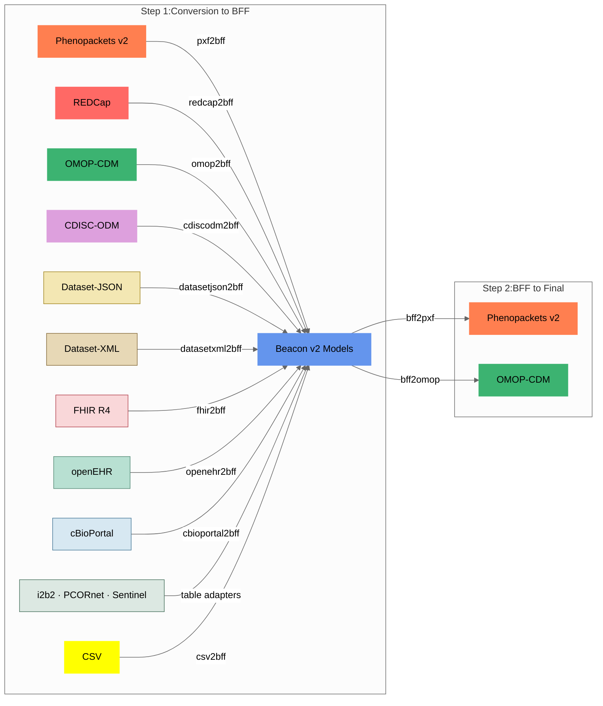

import Tabs from '@theme/Tabs';
import TabItem from '@theme/TabItem';
import useBaseUrl from '@docusaurus/useBaseUrl';

export const SourceHandlingDiagram = () => {
  const diagramUrl = useBaseUrl('/img/convert-pheno-source-handling.svg');

  return (
    
  );
};

## At a Glance

Most conversions use `BFF` as the internal target model:

| Step | Operation | Reason |
|------|-----------|--------|
| 1 | Normalize source data as Beacon v2 Models / BFF | Use one internal representation for most routes |
| 2 | Convert BFF to the requested final model when needed | Keep source parsing separate from output serialization |
| 3 | Retain source values where the route supports it | Permit auditing and source-field queries |

:::tip[Practical shortcut]
For commands, go directly to [Choose a Conversion](conversion-recipes). The
sections below document the mapping decisions behind those commands.
:::

:::warning[Check the longitudinal representation]
A BFF `individuals` object may represent a person with events aggregated across
visits, or a snapshot of one person at one visit or timepoint. Establish which
representation the data uses before counting people, grouping records, or
converting longitudinal data. The full distinction, including Convert-Pheno's
private `_visit` extension, is explained in the advanced mapping details below.
:::

## Step 1: Conversion to the target model

For **most routes**, `Convert-Pheno` first maps the input data to [BFF](bff), the Beacon v2 Models-based format that acts as the **internal target model**. From there, the data can remain as `BFF` or continue to other outputs such as `PXF` or `OMOP CDM`.


```mermaid
%%{init: {'theme':'neutral'}}%%
graph LR
  subgraph "Step 1:Conversion to BFF"
  B[Phenopackets v2] -->|pxf2bff| A
  C[REDCap] -->|redcap2bff| A[Beacon v2 Models]
  D[OMOP-CDM] -->|omop2bff| A
  E[CDISC-ODM] -->|cdiscodm2bff| A
  I[Dataset-JSON] -->|datasetjson2bff| A
  X[Dataset-XML] -->|datasetxml2bff| A
  J[FHIR R4] -->|fhir2bff| A
  K[openEHR] -->|openehr2bff| A
  Q[cBioPortal] -->|cbioportal2bff| A
  R["i2b2 · PCORnet · Sentinel"] -->|table adapters| A
  G[CSV] -->|csv2bff| A
  end

  subgraph "Step 2:BFF to Final"
  A --> |bff2pxf | F[Phenopackets v2]
  A --> |bff2omop| H[OMOP-CDM]
  end

  style A fill: #6495ED, stroke: #6495ED
  style B fill: #FF7F50, stroke: #FF7F50
  style C fill: #FF6965, stroke: #FF6965
  style D fill: #3CB371, stroke: #3CB371
  style E fill: #DDA0DD, stroke: #DDA0DD
  style F fill: #FF7F50, stroke: #FF7F50
  style G fill: #FFFF00, stroke: #FFFF00
  style H fill: #3CB371, stroke: #3CB371
  style I fill: #F3E7B3, stroke: #A58A28
  style X fill: #E7D8B6, stroke: #8A7040
  style J fill: #F9D7D9, stroke: #B74A55
  style K fill: #B8E0D2, stroke: #5B8F7B
  style Q fill: #D7E8F2, stroke: #507F9D
  style R fill: #DCE8E2, stroke: #507865

```
<figcaption>Convert-Pheno internal mapping steps</figcaption>

<details>
<summary>Why use Beacon v2 Models as the target model?</summary>

* **JSON Schema:** Beacon v2 Models are defined with [JSON Schema](https://github.com/ga4gh-beacon/beacon-v2/tree/main/models), which is useful for validation and inspection.
* **Additional properties:** The Beacon v2 Models schema allows additional properties, which helps preserve source values that do not have a first-class target field.
* **Beacon v2 API alignment:** BFF follows the data shape expected by Beacon v2-oriented deployments.
* **Multi-entity output:** Beacon v2 Models provide entities beyond `individuals`, including `biosamples`, `datasets`, and `cohorts`.
* **Overlap with Phenopackets v2:** Several clinical and phenotypic concepts are shared or closely aligned between the models.

</details>
<details>
<summary>Advanced mapping details, ontology preservation, and search behavior</summary>

### Schema mapping

When starting a new conversion between two data models, the first step is to **map variables** between the two data schemas.

<details>
<summary>Mapping strategy: External or hardcoded?</summary>

In the early stages of development, we considered configuration files for schema-to-schema mapping. Deeply nested JSON structures made that impractical for most routes. The exception is mapping-file input such as [REDCap](redcap), [CSV](csv), and [CDISC-ODM](cdisc-odm), where source fields are project-specific and user configuration is necessary.

</details>
The **Mapping tables** under Technical Details record the equivalences used by
each route. They are intended for three audiences:

1. They summarize the intended mapping without requiring readers to inspect the code first.
2. Domain experts can review the mapping assumptions and suggest corrections.
3. Contributors can use them as a starting point for new conversion routes.

:::caution[Mapping review]
Schema-valid output can still contain a poor semantic mapping. The tables are
revised when new source examples or domain review identify a better choice.

:::
<details>
<summary>Contributing</summary>

Open an [issue](https://github.com/CNAG-Biomedical-Informatics/convert-pheno/issues)
before changing a mapping so the source example and expected target can be
reviewed together.


</details>
### From table mappings to code

Each format has a dedicated Perl
[module](https://github.com/CNAG-Biomedical-Informatics/convert-pheno/tree/main/lib/Convert/Pheno).
The tables describe its intended behavior; fixtures and target validators check
the implementation.

### Lossless or lossy conversion?

Source handling depends on the route. A value may populate a target field,
remain as provenance, do both, or be omitted. If a required target field cannot
be built, the route may use a documented default, omit the affected item, or
stop with an error.

<figure className="convertDiagramFrame">
<div className="convertDiagramScroller">
<SourceHandlingDiagram />
</div>
<figcaption>Possible source-data outcomes during conversion. More than one outcome can apply to the same value.</figcaption>
</figure>

Clinical data models do not represent every concept in the same way, so some
conversions are lossy. Several BFF routes retain source context through the
`additionalProperties` permitted by the Beacon v2 Models
[schema](https://docs.genomebeacons.org/schemas-md/individuals_defaultSchema/).
This supports auditing and later source-field queries. Check the mapping table
for the route because provenance retention is not universal.

Two common preservation strategies are shown below:


<Tabs>
<TabItem value="unmappable-variables" label="Unmappable variables">


Input data can contain variables that do not directly map to the target but remain useful as source context. Depending on the route, this context may be retained under `_info` on a mapped element or in a route-specific `info` snapshot. Element-level `_info` is common in conversions from OMOP CDM to BFF.

Example extracted from `omop2bff` [conversion](https://github.com/CNAG-Biomedical-Informatics/convert-pheno/blob/main/t/omop2bff/out/individuals.json):
 
<details>
<summary>See example</summary>

```json
        "interventionsOrProcedures" : [
               {
                  "_info" : {
                     "PROCEDURE_OCCURRENCE" : {
                        "OMOP_columns" : {
                           "modifier_concept_id" : 0,
                           "modifier_source_value" : null,
                           "person_id" : 2,
                           "procedure_concept_id" : 4163872,
                           "procedure_date" : "1955-10-22",
                           "procedure_datetime" : "1955-10-22 00:00:00",
                           "procedure_occurrence_id" : 6,
                           "procedure_source_concept_id" : 4163872,
                           "procedure_source_value" : 399208008,
                           "procedure_type_concept_id" : 38000275,
                           "provider_id" : "\\N",
                           "quantity" : "\\N", 
                           "visit_detail_id" : 0,
                           "visit_occurrence_id" : 103
                        }
                     }
                  },
                  "ageAtProcedure" : {
                     "age" : {
                        "iso8601duration" : "35Y"
                     }
                  },
                  "dateOfProcedure" : "1955-10-22",
                  "procedureCode" : {
                     "id" : "SNOMED:399208008",
                     "label" : "Plain chest X-ray"
                  }
               }
         ]
        ```

</details>
Example extracted from `redcap2bff` [conversion](https://github.com/CNAG-Biomedical-Informatics/convert-pheno/blob/main/t/redcap2bff/out/individuals.json):

<details>
<summary>See example</summary>

```json
        "treatments" : [
               {
                  "_info" : {
                     "dose" : null,
                     "drug" : "budesonide",
                     "drug_name" : "budesonide",
                     "duration" : null,
                     "field" : "budesonide_oral_status",
                     "route" : "oral",
                     "start" : null,
                     "status" : "never treated",
                     "value" : 1
                  },
                  "doseIntervals" : [],
                  "routeOfAdministration" : {
                     "id" : "NCIT:C38288",
                     "label" : "Oral Route of Administration"
                  },
                  "treatmentCode" : {
                     "id" : "NCIT:C1027",
                     "label" : "Budesonide"
                  }
               }
        ]
        ```

</details>

::::warning[Person records and longitudinal snapshots are not the same]

Beacon v2 `individuals` records describe people, but the model does not provide
a native Visit or Encounter entity. Longitudinal data therefore requires an
explicit representation choice.

- **Person representation:** one BFF `individuals` object represents one person.
  Clinical events from multiple visits are aggregated into arrays within that
  object. When OMOP visit context is available, Convert-Pheno adds the private
  `_visit` property to mapped diseases, measurements, treatments, procedures,
  and phenotypic features so that events from the same encounter can still be
  associated.

- **Snapshot representation:** one individual-shaped JSON object represents one
  person at one visit, timepoint, or other observation point. Several objects
  can therefore refer to the same person. The snapshot identifier and the
  stable person identifier must be kept separate and documented.

These representations must not be interpreted interchangeably. In particular:

- the number of JSON objects is not necessarily the number of people;
- participant-level analyses must group snapshots by their stable person
  identifier;
- visit-level analyses must not silently merge separate snapshots;
- conversion between representations must preserve person, visit, timepoint,
  and source provenance.

`_visit` is a Convert-Pheno extension used to preserve encounter relationships;
it is not a native Beacon v2 or Phenopackets field. Convert-Pheno removes this
private helper property when writing standard PXF. Phenopackets v2 can represent
the timing of individual findings through `TimeElement`, but timing alone does
not preserve the shared identity of a clinical visit.

Consumers of longitudinal BFF should therefore know, or explicitly declare,
whether the input uses person or snapshot representation before counting,
grouping, converting, or analysing its records.

::::

Example of longitudinal data stored under `_visit` in a `omop2bff` [conversion](https://github.com/CNAG-Biomedical-Informatics/convert-pheno/blob/main/t/omop2bff/out/individuals.json):

<details>
<summary>See example</summary>

```json
        "_visit" : {
                "_info" : {
                   "VISIT_OCCURRENCE" : {
                      "OMOP_columns" : {
                         "admitting_source_concept_id" : 0,
                         "admitting_source_value" : null,
                         "care_site_id" : "\\N",
                         "discharge_to_concept_id" : 0,
                         "discharge_to_source_value" : null,
                         "person_id" : 3,
                         "preceding_visit_occurrence_id" : 347,
                         "provider_id" : "\\N",
                         "visit_concept_id" : 9201,
                         "visit_end_date" : "1972-12-21",
                         "visit_end_datetime" : "1972-12-21 00:00:00",
                         "visit_occurrence_id" : 312,
                         "visit_source_concept_id" : 0,
                         "visit_source_value" : "5d035dd1-30d9-4389-b94c-64947bf1f18c",
                         "visit_start_date" : "1972-12-20",
                         "visit_start_datetime" : "1972-12-20 00:00:00",
                         "visit_type_concept_id" : 44818517
                      }
                   }
                },
                "concept" : {
                   "id" : "Visit:IP",
                   "label" : "Inpatient Visit"
                },
                "end_date" : "1972-12-21T00:00:00Z",
                "id" : "312",
                "occurrence_id" : 312,
                "start_date" : "1972-12-20T00:00:00Z",
                "type" : {
                   "id" : "Visit_Type:OMOP4822465",
                   "label" : "Visit derived from encounter on claim"
                }
             },
             "featureType" : {
                "id" : "SNOMED:428251008",
                "label" : "History of appendectomy"
             },
             "onset" : {
                "iso8601duration" : "56Y"
             }
        }
        ```

</details>

</TabItem>
<TabItem value="match-to-a-different-entity" label="Match to a different entity">


When source data belongs to another Beacon entity, entity-aware output writes
it to that entity when the route supports it. For example, a Phenopacket
`biosamples` array can become a separate Beacon
[biosamples](https://docs.genomebeacons.org/schemas-md/biosamples_defaultSchema/)
collection. The original Phenopacket can also remain under `info` when source
provenance is enabled.
 
Example source provenance from the `pxf2bff`
[fixture](https://github.com/CNAG-Biomedical-Informatics/convert-pheno/blob/main/t/pxf2bff/out/individuals.json):
 
<details>
<summary>See example</summary>

```json
        "info" : {
                  "phenopacket" : {
                     "biosamples" : [
                        {
                           "id" : "biosample.1",
                           "phenotypicFeatures" : [
                              {
                                 "excluded" : false,
                                 "type" : {
                                    "id" : "HP:0003798",
                                    "label" : "Nemaline bodies"
                                 }
                              }
                           ],
                           "procedure" : {
                              "bodySite" : {
                                 "id" : "UBERON:0002378",
                                 "label" : "muscle of abdomen"
                              },
                              "code" : {
                                 "id" : "NCIT:C51895",
                                 "label" : "Muscle Biopsy"
                              },
                              "performed" : {
                                 "age" : {
                                    "iso8601duration" : "P1D"
                                 }
                              }
                           },
                           "sampledTissue" : {
                              "id" : "UBERON:0002378",
                              "label" : "muscle of abdomen"
                           }
                        }
                     ]
               }
        }
        ```

</details>

</TabItem>
</Tabs>
### Preservation and augmentation of ontologies

Beacon v2 Models and Phenopackets v2 accept terms from different ontologies.
Convert-Pheno therefore keeps source ontology identifiers where a direct
mapping exists and resolves terms only where the route requires it.

<details>
<summary>Which ontologies/terminologies are supported?</summary>

 
If the input files contain ontology terms, the **ontologies will be preserved** and remain intact after the conversion process, except for:
 
* _Beacon v2 Models_ and _Phenopackets v2_: the property `sex` is converted to [NCI Thesaurus](https://ncithesaurus.nci.nih.gov/ncitbrowser) via database search.
* _OMOP CDM_: the properties `sex`, `ethnicity`, and `geographicOrigin` are converted to [NCI Thesaurus](https://ncithesaurus.nci.nih.gov/ncitbrowser) via database search.

|                | CSV |  REDCap      | CDISC-ODM  | OMOP-CDM | Phenopackets v2| Beacon v2 Models |
| -----------    | ----|-------       | ---------- | -------  | -------------- | -----------------|
| Data mapping   | ✓   | ✓ | ✓ | ✓ | ✓ | ✓ |
| Add ontologies | ✓   | ✓ | ✓ | `--ohdsi-db` |     |                  |

**Terminology search**
   
For input types that do not contain ontology identifiers, such as `CSV`,
_REDCap_, and _CDISC-ODM_, mapping rules can search bundled terminology
databases. The data owner controls which source fields and labels are queried.
Supported databases include:
  
* [Athena-OHDSI](https://athena.ohdsi.org/search-terms/start) standardized vocabulary, which includes multiple terminologies, such as _SNOMED, RxNorm or LOINC_
* [NCI Thesaurus](https://ncithesaurus.nci.nih.gov/ncitbrowser)
* [ICD-10](https://icd.who.int/browse10) terminology
* [CDISC](https://www.cdisc.org/standards/terminology/controlled-terminology) (Study Data Tabulation Model Terminology)
* [OMIM](https://www.omim.org/) Online Mendelian Inheritance in Man
* [HPO](https://hpo.jax.org/app) Human Phenotype Ontology (Note that prefixes are `HP:`, without the `O`)

Dataset-JSON and Dataset-XML have a built-in structural SDTM mapping. Their
optional compact mapping file controls terminology only: direct terms,
reviewed label queries, and aliases. Supported NCI identifiers in Define-XML
are resolved exactly. Values that remain unresolved use a source-derived
`CDISC:` identifier. See [Dataset-JSON to BFF](datasetjson2bff) and
[Dataset-XML to BFF](datasetxml2bff).

FHIR preserves codings from recognized systems with prefixes such as `LOINC:`,
`SNOMEDCT:`, `RxNorm:`, `UCUM:`, and `HP:`. Unknown systems and uncoded text use
source-derived FHIR identifiers rather than the mapping-file database search.
See [FHIR to BFF](fhir2bff) for the exact policy.

</details>
<div className="convertNotePanel">
  <p>
    Mapping-file routes can resolve source labels with `--search exact`,
    `--search mixed`, or `--search fuzzy`. The detailed scoring behavior,
    precedence, audit columns, and threshold guidance are documented in
    <a href="terminology-search">Terminology Search</a>.
  </p>
</div>

</details>
## Step 2: Conversion to the final model

:::tip[Development validation]
The validator-assisted development process is described in [Development Validation](development-validation), including the Beacon/BFF, Phenopackets/PXF, and OMOP CSV checks.
:::
### To Phenopackets 

If the output is set to [Phenopackets v2](pxf) then a second step (`bff2pxf`) is performed (see diagram above).

<details>
<summary>BFF and PXF community alignment</summary>

The current mapping covers the terms exercised by the available fixtures and
project datasets. Additional cases can be proposed through the issue tracker
with a source example and expected Phenopackets representation.

</details>
### To OMOP CDM

If the output is set to [OMOP CDM](omop-cdm) then a second step (`bff2omop`) is performed (see diagram above).
