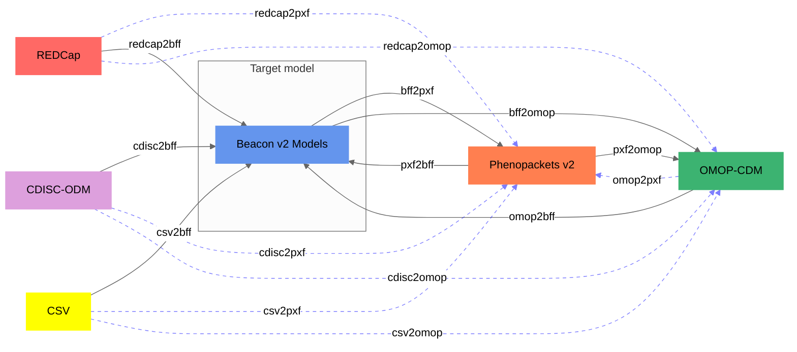
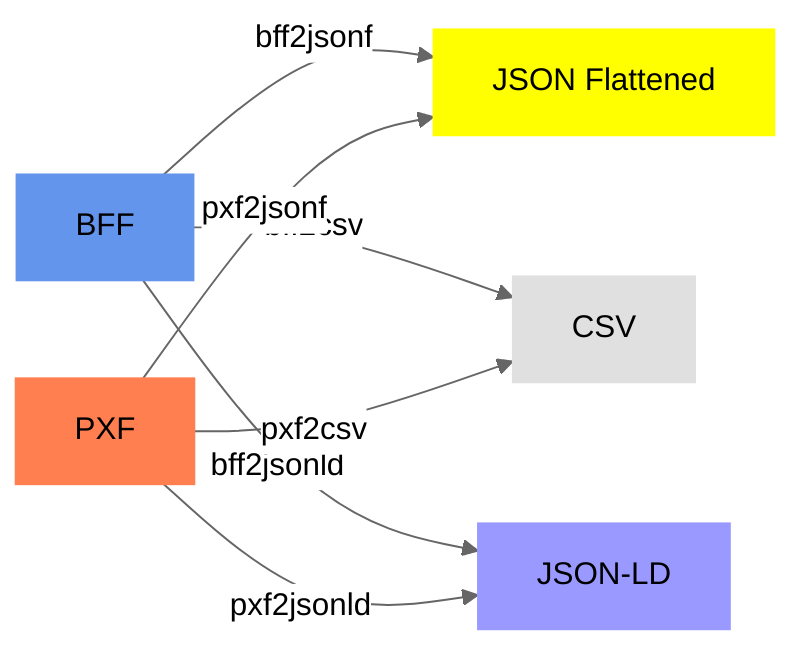

import Link from '@docusaurus/Link';
import Tabs from '@theme/Tabs';
import TabItem from '@theme/TabItem';

This page gives a compact overview of the formats that `Convert-Pheno` can read and write. Internally, most conversions go through `BFF` first, and then continue to the requested output format when needed.

  <Link className="convertFormatCard" to="/bff">
    Beacon
    <h3>BFF</h3>
    
Input and output. BFF output can include individuals, biosamples, datasets, and cohorts.

  </Link>
  <Link className="convertFormatCard" to="/pxf">
    GA4GH
    <h3>Phenopackets v2</h3>
    
Input and output for phenotypic and biosample-centered records.

  </Link>
  <Link className="convertFormatCard" to="/omop-cdm">
    Clinical DB
    <h3>OMOP-CDM</h3>
    
SQL or CSV input, and CSV output for selected OMOP tables.

  </Link>
  <Link className="convertFormatCard" to="/redcap">
    Mapping file
    <h3>REDCap</h3>
    
CSV exports with data dictionary support and ontology search auditing.

  </Link>
  <Link className="convertFormatCard" to="/cdisc-odm">
    Mapping file
    <h3>CDISC-ODM</h3>
    
XML input using the same mapping model as other tabular conversions.

  </Link>
  <Link className="convertFormatCard" to="/csv">
    Mapping file
    <h3>CSV</h3>
    
Generic tabular input for BFF, PXF, and OMOP output routes.

  </Link>

:::note[Note]
`openEHR` support is currently **experimental** and currently limited to **canonical composition input** with `BFF` and `PXF` output. Patient identity must be resolvable from the payload or envelope, and multi-patient input is grouped automatically.

:::

<figcaption>Supported conversions. Dotted blue lines go via BFF, which serves as the target model for most routes.</figcaption>

<Tabs>
<TabItem value="input-formats" label="Input formats">

- [Beacon v2 Models (JSON | YAML)](bff)
- [Phenopackets v2 (JSON | YAML)](pxf)
- [OMOP-CDM (SQL export | CSV)](omop-cdm)
- `openEHR` canonical JSON/YAML compositions (`experimental`)
- [REDCap exports (CSV)](redcap)
- [CDISC-ODM v1 (XML)](cdisc-odm)
- [CSV raw data](csv)

</TabItem>
<TabItem value="main-output-formats" label="Main output formats">

- [Beacon v2 Models (JSON | YAML)](bff)
- [Phenopackets v2 (JSON | YAML)](pxf)
- [OMOP CDM (CSV)](omop-cdm)

</TabItem>
</Tabs>
## Additional output formats

For `BFF` and `PXF` input, the tool can also produce simpler output forms that are easier to inspect or use downstream:

- flattened JSON or YAML with `--ojsonf`
- CSV with `--ocsv`
- JSON-LD or YAML-LD with `--ojsonld`

<figcaption>Additional output formats from BFF and PXF.</figcaption>

:::note[Why BFF matters in the diagrams]
`BFF` is the target model for most conversions. User-facing output, however, is not limited to `BFF`: Convert-Pheno also supports `PXF` and `OMOP CDM` output paths.
:::
