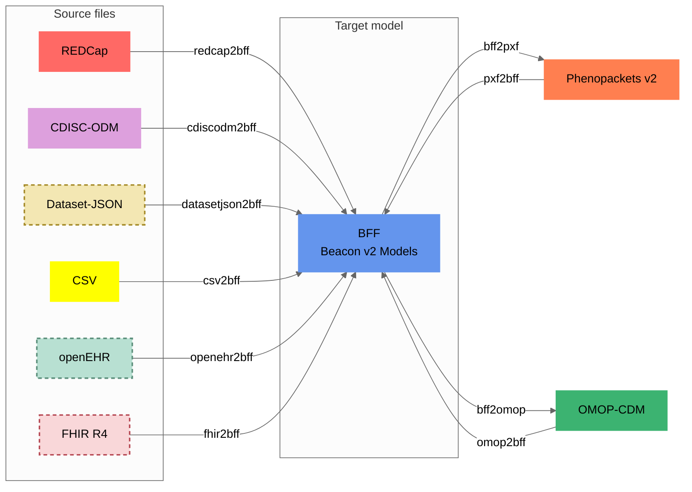
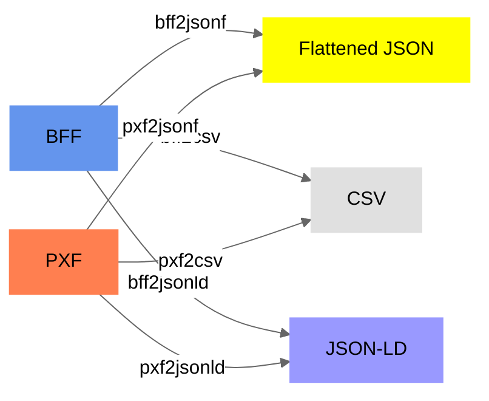

This page is a quick map of the formats that `Convert-Pheno` can read and write. For file requirements and format-specific options, use the **Format Guides** in the sidebar.

- **Inputs:** [BFF](bff), [Phenopackets v2](pxf), [OMOP-CDM](omop-cdm), [REDCap](redcap), [CDISC-ODM](cdisc-odm), [CDISC Dataset-JSON](dataset-json), [FHIR R4 Bundles](fhir), [CSV](csv), and [openEHR canonical compositions](openehr)
- **Main outputs:** BFF, Phenopackets v2, and OMOP-CDM CSV tables
- **[Inspection outputs](conversion-recipes#inspection-outputs):** flattened JSON or YAML, CSV, and JSON-LD or YAML-LD from BFF or PXF input

Most routes use BFF as the internal target model. The CLI handles any intermediate BFF conversion automatically.

## Conversion map

```mermaid
%%{init:{'theme':'neutral'}}%%
graph LR
  subgraph "Source files"
    C[REDCap]
    E[CDISC-ODM]
    H[Dataset-JSON]
    F[CSV]
    G[openEHR]
    J[FHIR R4]
  end

  subgraph "Target model"
    A["BFF<br/>Beacon v2 Models"]
  end

  C -->|redcap2bff| A
  E -->|cdiscodm2bff| A
  H -->|datasetjson2bff| A
  F -->|csv2bff| A
  G -->|openehr2bff| A
  J -->|fhir2bff| A
  B[Phenopackets v2] -->|pxf2bff| A
  A -->|bff2pxf| B
  D[OMOP-CDM] -->|omop2bff| A
  A -->|bff2omop| D

  style A fill:#6495ED,stroke:#6495ED
  style B fill:#FF7F50,stroke:#FF7F50
  style C fill:#FF6965,stroke:#FF6965
  style D fill:#3CB371,stroke:#3CB371
  style E fill:#DDA0DD,stroke:#DDA0DD
  style H fill:#F3E7B3,stroke:#A58A28,stroke-width:2px,stroke-dasharray:5 4
  style F fill:#FFFF00,stroke:#FFFF00
  style G fill:#B8E0D2,stroke:#5B8F7B,stroke-width:2px,stroke-dasharray:5 4
  style J fill:#F9D7D9,stroke:#B74A55,stroke-width:2px,stroke-dasharray:5 4
```

<figcaption>Direct mapping steps around BFF, which can be the requested output or an internal intermediate. Any connected path through BFF runs as one CLI command: for example, Dataset-JSON to PXF performs Dataset-JSON to BFF and then BFF to PXF in memory. Dashed source borders mark implemented profiles with limited independent dataset coverage.</figcaption>

Additional outputs from BFF and PXF

For inspection and downstream processing, BFF and PXF input can also be written as flattened JSON or YAML, CSV, and JSON-LD or YAML-LD.

```mermaid
%%{init: {'theme':'neutral'}}%%
graph LR

  A[BFF] -->|bff2jsonf| C[Flattened JSON]
  A -->|bff2csv| D[CSV]
  A -->|bff2jsonld| E[JSON-LD]

  B[PXF] -->|pxf2jsonf| C
  B -->|pxf2csv| D
  B -->|pxf2jsonld| E

  style A fill:#6495ED,stroke:#6495ED
  style B fill:#FF7F50,stroke:#FF7F50
  style C fill:#FFFF00,stroke:#FFFF00
  style D fill:#E0E0E0,stroke:#E0E0E0
  style E fill:#9999FF,stroke:#9999FF
```

For runnable commands, continue to [Choose a Conversion](conversion-recipes).
