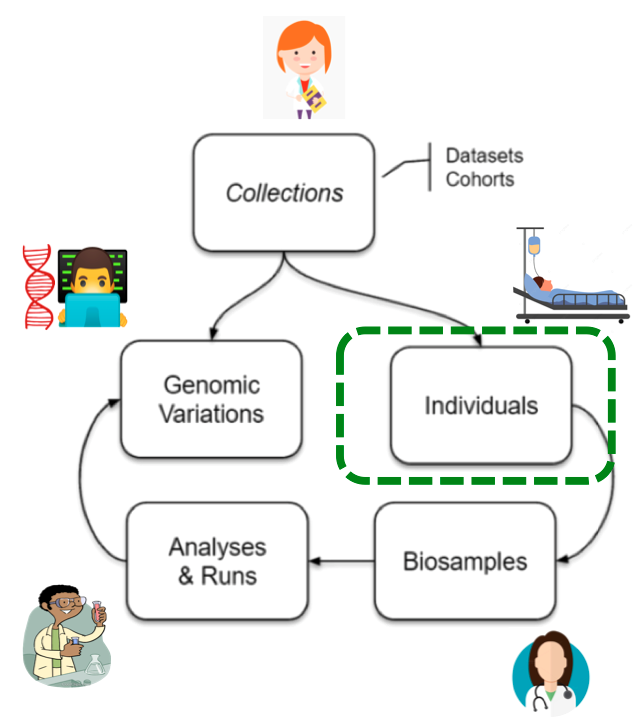

**BFF** stands for **B**eacon **F**riendly **F**ormat. The [BFF](https://b2ri-documentation.readthedocs.io/en/latest/data-ingestion) is a data exchange format composed of 7 `JSON` files. These files correspond to the 7 entities of the [Beacon v2 Models](https://docs.genomebeacons.org/models).


<figure markdown>
   { width="400" }
   <figcaption>Entities in Beacon v2 Models</figcaption>
</figure>

!!! Abstract "About Beacon v2 Models' entities"
    Among the Beacon v2 Models entities, [individuals](https://docs.genomebeacons.org/schemas-md/individuals_defaultSchema) is usually the main record-level carrier of phenotypic and clinical information. Other entities such as [biosamples](https://docs.genomebeacons.org/schemas-md/biosamples_defaultSchema), [datasets](https://docs.genomebeacons.org/schemas-md/datasets_defaultSchema), and cohorts are also important, but they tend to be more focused: `biosamples` capture specimen-level context, while `datasets` and `cohorts` are mostly collection-level metadata. In practice, this means `individuals` usually drives the most complex semantic mapping, whereas the other entities are often derived, enriched, or populated with lighter transformation rules.

`Convert-Pheno` supports `BFF` in both directions.

- As **input**, it currently accepts the [individuals](https://docs.genomebeacons.org/schemas-md/individuals_defaultSchema) entity serialized as `individuals.json`.
- As **output**, the CLI can emit `individuals`, `biosamples`, `datasets`, and `cohorts`.

So `BFF` is no longer only an `individuals`-centered output format, even though reverse conversion from `BFF` input is still centered on `individuals`.

??? Tip "Browsing BFF `JSON` data"
    You can browse a public BFF v2 file with the following **JSON viewers**:

    * [JSON Crack](https://jsoncrack.com/editor?json=https://raw.githubusercontent.com/cnag-biomedical-informatics/convert-pheno/main/t/bff2pxf/in/individuals.json)
    * [JSON Hero](https://jsonhero.io/new?url=https://raw.githubusercontent.com/cnag-biomedical-informatics/convert-pheno/main/t/bff2pxf/in/individuals.json)
    * [Datasette](https://lite.datasette.io/?json=https%3A%2F%2Fraw.githubusercontent.com%2Fcnag-biomedical-informatics%2Fconvert-pheno%2Fmain%2Ft%2Fomop2bff%2Fout%2Findividuals.json#/data?sql=select+*+from+individuals)

## BFF As Input { width="20" }

=== "Command-line"

    When using the `convert-pheno` command-line interface, simply ensure the [correct syntax](usage.md) is provided.

    ??? Tip "About `JSON` data in `individuals.json`"
        If the file `individuals.json` is a JSON array of objects (for which each object corresponds to an individual), the output `-opxf` file will also be a JSON array.

    ```
    convert-pheno -ibff individuals.json -opxf phenopacket.json
    ```

=== "Module"

    The concept is to pass the necessary information as a hash (in Perl) or dictionary (in Python).

    === "Perl"

        ```Perl
        $bff = {
            data => $my_bff_json_data,
            method => 'bff2pxf'
        };
        ```

    === "Python"

        ```Python
        bff = {
             "data" : my_bff_json_data,
             "method" : "bff2pxf"
        }
        ```

=== "API"

    Send a `POST` request to the API URL (see more info [here](use-as-an-api.md)) with a small payload like:

    ```json
    {
      "conversion": "bff2pxf",
      "input": {
        "data": {
          "id": "HG00096",
          "sex": {
            "id": "NCIT:C20197",
            "label": "male"
          }
        }
      },
      "output": {
        "entities": ["individuals"]
      }
    }
    ```

    Successful API responses wrap the conversion result under `data`.

## BFF As Output

As an output format, `BFF` can be emitted in two modes:

- **individuals-only BFF mode**, using `-obff FILE`
- **entity-aware mode**, using `--entities ... --out-dir DIR`, which can write multiple Beacon entities

The currently supported `BFF` output entities are:

- `individuals`
- `biosamples`
- `datasets`
- `cohorts`

Examples:

```bash
convert-pheno -ipxf pxf.json -obff individuals.json
convert-pheno -ipxf pxf.json --entities individuals biosamples --out-dir out/
convert-pheno -icsv clinical.csv --mapping-file clinical.yaml --entities individuals datasets cohorts --out-dir out/
```

At the moment, reverse conversion from `BFF` input still expects `individuals` rather than a full multi-entity Beacon bundle.

Please find below examples of data:

=== "BFF (input)"
    ```json
    {
      "ethnicity": {
        "id": "NCIT:C42331",
        "label": "African"
      },
      "id": "HG00096",
      "info": {
        "eid": "fake1"
      },
      "interventionsOrProcedures": [
        {
          "procedureCode": {
            "id": "OPCS4:L46.3",
            "label": "OPCS(v4-0.0):Ligation of visceral branch of abdominal aorta NEC"
          }
        }
      ],
      "measures": [
        {
          "assayCode": {
            "id": "LOINC:35925-4",
            "label": "BMI"
          },
          "date": "2021-09-24",
          "measurementValue": {
            "quantity": {
              "unit": {
                "id": "NCIT:C49671",
                "label": "Kilogram per Square Meter"
              },
              "value": 26.63838307
            }
          }
        },
        {
          "assayCode": {
            "id": "LOINC:3141-9",
            "label": "Weight"
          },
          "date": "2021-09-24",
          "measurementValue": {
            "quantity": {
              "unit": {
                "id": "NCIT:C28252",
                "label": "Kilogram"
              },
              "value": 85.6358
            }
          }
        },
        {
          "assayCode": {
            "id": "LOINC:8308-9",
            "label": "Height-standing"
          },
          "date": "2021-09-24",
          "measurementValue": {
            "quantity": {
              "unit": {
                "id": "NCIT:C49668",
                "label": "Centimeter"
              },
              "value": 179.2973
            }
          }
        }
      ],
      "sex": {
        "id": "NCIT:C20197",
        "label": "male"
      }
    }
    ```
    
=== "PXF (output)"
    ```json
    {
       "diseases" : [],
       "id" : "phenopacket_id.AUNb6vNX1",
       "measurements" : [
          {
             "assay" : {
                "id" : "LOINC:35925-4",
                "label" : "BMI"
             },
             "value" : {
                "quantity" : {
                   "unit" : {
                      "id" : "NCIT:C49671",
                      "label" : "Kilogram per Square Meter"
                   },
                   "value" : 26.63838307
                }
             }
          },
          {
             "assay" : {
                "id" : "LOINC:3141-9",
                "label" : "Weight"
             },
             "value" : {
                "quantity" : {
                   "unit" : {
                      "id" : "NCIT:C28252",
                      "label" : "Kilogram"
                   },
                   "value" : 85.6358
                }
             }
          },
          {
             "assay" : {
                "id" : "LOINC:8308-9",
                "label" : "Height-standing"
             },
             "value" : {
                "quantity" : {
                   "unit" : {
                      "id" : "NCIT:C49668",
                      "label" : "Centimeter"
                   },
                   "value" : 179.2973
                }
             }
          }
       ],
       "medicalActions" : [
          {
             "procedure" : {
                "code" : {
                   "id" : "OPCS4:L46.3",
                   "label" : "OPCS(v4-0.0):Ligation of visceral branch of abdominal aorta NEC"
                },
                "performed" : {
                   "timestamp" : "1900-01-01T00:00:00Z"
                }
             }
          }
       ],
       "metaData" : null,
       "subject" : {
          "id" : "HG00096",
          "sex" : "MALE",
          "vitalStatus" : {
             "status" : "ALIVE"
          }
       }
    }
    ```
