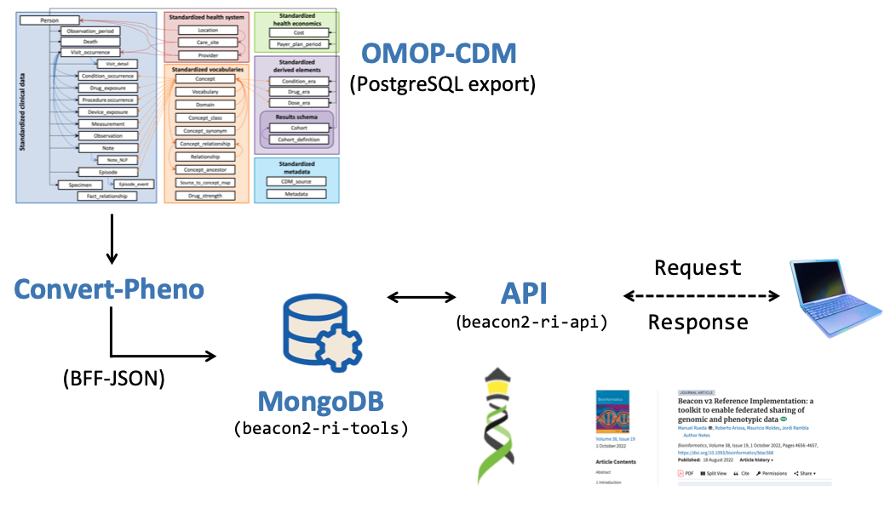
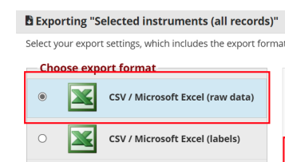
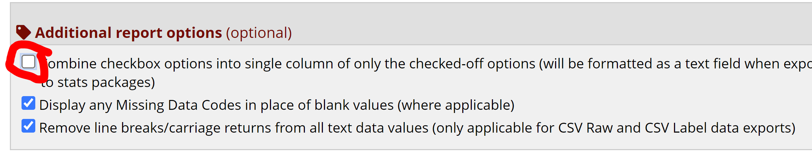

Frequently Asked Questions

## General

??? faq "What does `Convert-Pheno` do?"

    `Convert-Pheno` is an open-source software toolkit designed to **interconvert common data models for phenotypic data**. The software addresses the challenge of inconsistent data storage across various research centers by enabling seamless conversion between different data models like **Beacon v2 Models, CDISC-ODM, OMOP-CDM, Phenopackets v2, and REDCap**. This facilitates data sharing and integration, ultimately accelerating scientific progress and improving patient outcomes in precision medicine and public health.

    ##### last change 2023-01-05 by Manuel Rueda [:fontawesome-brands-github:](https://github.com/mrueda)

??? faq "Is `Convert-Pheno` free?"

    Yes. See the [license](https://github.com/mrueda/convert-pheno/blob/main/LICENSE).

    ##### last change 2023-01-04 by Manuel Rueda [:fontawesome-brands-github:](https://github.com/mrueda)

??? faq "Can I use `Convert-Pheno` in _production_ software?"

    It's still in Beta so expect some bumps ahead.

    ##### last change 2023-06-27 by Manuel Rueda [:fontawesome-brands-github:](https://github.com/mrueda)

??? faq "If I use `Convert-Pheno` to convert my data to [Beacon v2 Models](bff.md), does this mean I have a Beacon v2?"

    I am afraid not. Beacon v2 is an [API specification](https://docs.genomebeacons.org), and the [Beacon v2 Models](bff.md) are merely a component of it. In order to _light a Beacon v2_, it is necessary to load the `JSON` files into a **database** and add an an **API** on top. Currently, it is advisable to utilize the [Beacon v2 Reference Implementation](https://b2ri-documentation.readthedocs.io/en/latest) which includes the database, the Beacon v2 API, and other necessary components.

    See below an example in how to integrate an OMOP CDM export from SQL with Beacon v2.

    <figure markdown>
      { width="600" }
      <figcaption>Beacon v2 RI integration</figcaption>
    </figure>

    ##### last change 2023-06-20 by Manuel Rueda [:fontawesome-brands-github:](https://github.com/mrueda)

??? faq "What is the difference between Beacon v2 Models and Beacon v2?"

    **Beacon v2** is a specification to build an [API](https://docs.genomebeacons.org). The [Beacon v2 Models](https://docs.genomebeacons.org/models/) define the format for the API's responses to queries regarding biological data. With the help of `Convert-Pheno`, data exchange text files ([BFF](bff.md)) that align with this response format can be generated. By doing so, the BFF files can be integrated into a non-SQL database, such as MongoDB, without the API having to perform any additional data transformations internally.

    ##### last change 2023-02-13 by Manuel Rueda [:fontawesome-brands-github:](https://github.com/mrueda)

??? faq "Why are there so many clinical data standards?"

    The healthcare industry uses various data standards to meet diverse needs for data exchange, storage, and analysis, tailored for specific purposes like real-time clinical use or research. The abundance of standards also stems from a lack of communication and coordination among different organizations and stakeholders.

    ### Overview of Key Healthcare Data Standards and Models

    | Standard/Model     | Purpose                                                                                       | Data Persistence                                                | Live Data Use (Clinical Settings) | Secondary Data Use (Research Settings) |
    |--------------------|------------------------------------------------------------------------------------------------|-----------------------------------------------------------------|------------------------------------|-----------------------------------------|
    | **Beacon v2**      | Facilitates the discovery and sharing of genomic data, enabling researchers to find relevant genomic datasets across different repositories. | Not designed for long-term storage; focuses on data discovery.  | No                                 | Yes                                     |
    | **CDISC-ODM**      | Manages and archives clinical trial data, providing a standardized format for the exchange and submission of clinical research data. | Strong support for long-term data archiving and regulatory submissions. | No                                 | Yes                                     |
    | **HL7/CDA**        | Standardizes the structure and semantics of clinical documents (such as discharge summaries and progress notes) for exchange. | Ensures structured document storage; persistence depends on implementation. | Yes                                | Yes                                     |
    | **HL7/FHIR**       | Facilitates the exchange of healthcare information electronically, supporting interoperability across different health IT systems. | Provides guidelines for data exchange; persistence depends on implementation. | Yes                                | Yes                                     |
    | **OMOP CDM**       | Standardizes and harmonizes health data for research and secondary use, focusing on observational health data analysis. | Supports data persistence for research purposes, not real-time use. | No                                 | Yes                                     |
    | **openEHR**        | Offers a comprehensive standard for electronic health records, focusing on accurate, long-term clinical data storage and real-time use. | Designed for robust, long-term clinical data persistence.       | Yes                                | Yes                                     |
    | **Phenopackets v2**| Standardizes the exchange of detailed phenotypic data, particularly for genetic and rare disease research. | Not designed for long-term storage; focuses on data exchange.   | No                                 | Yes                                     |
    | **REDCap**         | Provides a secure, web-based application for building and managing online surveys and databases, primarily used in research settings. | Supports data persistence for research projects and surveys.    | No                                 | Yes                                     |

    ##### last change 2024-07-12 by Manuel Rueda [:fontawesome-brands-github:](https://github.com/mrueda)

??? faq "Are you planning in supporting other clinical data formats?"

    Afirmative, but it will depend on community adoption. Please check our [roadmap](future-plans.md) for more information.

    ##### last change 2023-01-04 by Manuel Rueda [:fontawesome-brands-github:](https://github.com/mrueda)

??? faq "Are longitudinal data supported?"

    Although Beacon v2 and Phenopackets v2 allow for storing time information in some properties, there is currently no way to associate medical visits to properties. To address this:

    * `omop2bff` -  we added an _ad hoc_ property (**_visit**) to store medical visit information for longitudinal events in variables that have it (e.g., measures, observations, etc.).

    * `redcap2bff` - In REDCap, visit/event information is not stored at the record level. We added this information inside `info` property.

    We raised this issue to the respective communities in the hope of a more permanent solution.

    ##### last change 2023-03-24 by Manuel Rueda [:fontawesome-brands-github:](https://github.com/mrueda)

??? faq "What is an "ontology" in Beacon v2 and Phenopacket v2 context?"

    In the context of Phenopackets and Beacon v2, the terms [ontologyClass](https://phenopacket-schema.readthedocs.io/en/latest/ontologyclass.html) and [ontologyTerm](https://github.com/ga4gh-beacon/beacon-v2/blob/main/framework/src/common/ontologyTerm.yaml) denote standardized identifiers derived from ontologies such as [HPO](https://en.wikipedia.org/wiki/Human_Phenotype_Ontology) or [NCIt](https://ncithesaurus.nci.nih.gov/ncitbrowser/), and terminologies like [LOINC](https://en.wikipedia.org/wiki/LOINC) or [RxNorm](https://en.wikipedia.org/wiki/RxNorm). The use of "ontology" here is broad, covering both actual ontologies—with their complex semantic relationships and inference abilities—and classifications like LOINC and RxNorm, which, despite not fitting the strict definition of an ontology, serve similar purposes in data standardization.

    ##### last change 2024-04-01 by Manuel Rueda [:fontawesome-brands-github:](https://github.com/mrueda)

??? faq "I have a collection of PXF files encoded using HPO and ICD-10 terms, and I need to convert them to BFF format, but encoded in OMIM and SNOMED-CT terminologies. Can you assist me with this?"

    Neither Phenopacket v2 nor Beacon v2 prescribe the use of a specific ontology; they simply provide [recommendations](https://phenopacket-schema.readthedocs.io/en/latest/recommended-ontologies.html) on their websites. Thereby, `Convert-Pheno` does not change the source ontologies.

    Now, IMHO, it's generally easier to inter-convert ontology terms (it's just a mapping exercise) than to inter-convert data schemas...so here is that:smile:.

    !!! Abstract "Nota Bene:"
        A  standard that does enforce the use of an **standardized vocabulary** is [OMOP CDM](omop-cdm.md), you may wanna check it out.

    ##### last change 2024-01-16 by Manuel Rueda [:fontawesome-brands-github:](https://github.com/mrueda)

??? faq "Error Handling for `CSV_XS ERROR: 2023 - EIQ - QUO character not allowed @ rec 1 pos 21 field 1`"


    This indicates a problem with the character used to separate data fields in your file. Our script automatically detects the separator based on the file extension (e.g., it expects commas for `.csv` files). However, discrepancies can arise if the actual data separator doesn't match the expected one based on the file extension.

    ### Solutions

    - **Ensure Consistent Separator Use**: If you're using REDCap for input, verify that both `--iredcap` and `--rcd` files are configured to use the identical separator. This consistency is crucial for correct data processing.

    - **Specify Separator Manually in Command Line**: In cases where the default separator detection fails, you can manually specify the correct separator. For example, to use a tab as your separator, utilize the following syntax in the CLI:

    ```bash
    --sep $'\t'
    ```

    ##### last change 2024-02-06 by Manuel Rueda [:fontawesome-brands-github:](https://github.com/mrueda)

??? faq "Should I export my REDCap project as _raw data_ or as _labels_ for use with `Convert-Pheno`?"

    For use with `Convert-Pheno`, we recommend that you export your REDCap project as **CSV / Microsoft Excel (raw data)**. It's important to include the corresponding dictionary file with your export. For detailed instructions on how to prepare your export correctly, refer to the [Convert-Pheno tutorial](https://cnag-biomedical-informatics.github.io/convert-pheno/tutorial/#how-to-convert).

    <figure markdown>
      { width="300" }
      <figcaption>Example of REDCap export settings. Source: [CDC](https://www.cdc.gov/nhsn/pdfs/validation/2022/export-data-from-redcap.pdf)
    </figure>

    Additionally, when configuring your export settings, ensure that in the **Additional report options**, the option "Combine checkbox options into single column of only the checked-off options" is **not** selected.

    <figure markdown>
      { width="600" }
      <figcaption>REDCap checkbox export settings</figcaption>
    </figure>

    If your data has been exported as **CSV / Microsoft Excel (labels)** you can use follow the [CSV input](csv.md) route.

    ##### last change 2024-05-18 by Manuel Rueda [:fontawesome-brands-github:](https://github.com/mrueda)


## Analytics

??? faq "How can I obtain statistics from the `individuals.json` file if I'm not familiar with `JSON` format? Any suggestions?"

    My first recommendation is to use `jq`, which is like `grep` for `JSON`.

    Let's begin by generating a `TSV` (Tab-Separated Values) file where each row represents an individual, and the columns correspond to the array variables:

    ```bash
    jq -r '["id", "diseases", "exposures", "interventionsOrProcedures", "measures", "phenotypicFeatures", "treatments"], (.[] | [.id, (.diseases | length), (.exposures | length), (.interventionsOrProcedures | length), (.measures | length), (.phenotypicFeatures | length), (.treatments | length)]) | @tsv' < individuals.json > results.tsv
    ```

    Another valid option to acomplish the same task is to resort to a scripting language such as `Python` or `Perl`:

    ??? Abstract "Python code"
        ```python
        import json
        import pandas as pd

        # Load the JSON data from individuals.json
        with open('individuals.json', 'r') as json_file:
            data = json.load(json_file)

        # Define the keys you want to extract
        keys = [ "diseases", "exposures", "interventionsOrProcedures", "measures", "phenotypicFeatures", "treatments"]

        # Create a list of dictionaries with the extracted values
        result_data = [
            {
                "id": item["id"],
                **{key: len(item.get(key, [])) for key in keys}
            }
            for item in data
        ]

        # Create a DataFrame from the list of dictionaries
        df = pd.DataFrame(result_data)

        # Save the DataFrame to results.tsv with tab as the separator
        df.to_csv('results.tsv', sep='\t', index=False)
        ```

    ??? Abstract "Perl code"
        ```perl
        use strict;
        use warnings;
        use autodie;
        use JSON::XS;
        use Text::CSV_XS qw(csv);
         
        # Open the JSON file and read the data
        open my $json_file, '<', 'individuals.json';
        my $json_text = do { local $/; <$json_file> };
        my $data = decode_json($json_text);
        close $json_file;
         
        # Define the keys you want to extract
        my @keys = ("diseases", "exposures", "interventionsOrProcedures", "measures", "phenotypicFeatures", "treatments");
         
        # Initialize the data array with the header row
        my $aoa = [["id", @keys]];
         
        # Process the data
        foreach my $item (@$data) {
            my @row = ($item->{"id"});
            foreach my $key (@keys) {
                push @row, scalar @{$item->{$key} // []};
            }
            push @$aoa, \@row;
        }
         
        # Write array of arrays as csv file
        csv(in => $aoa, out => "results.tsv", sep_char => "\t", eol => "\n");
        ```

    ??? Example "See result"
        When you run this in, for example, this [file](https://github.com/mrueda/beacon2-ri-tools/blob/main/CINECA_synthetic_cohort_EUROPE_UK1/bff/individuals.json), you'll obtain a text file in the following format:

        |     id    | diseases | exposures | interventionsOrProcedures | measures | phenotypicFeatures | treatments |
        |:---------:|:--------:|:---------:|:-------------------------:|:--------:|:------------------:|:----------:|
        |  HG00096  |    0     |     0     |            1              |    3     |         0          |     0      |
        |  HG00097  |    0     |     0     |            1              |    3     |         0          |     0      |
        |  HG00099  |    0     |     0     |            1              |    3     |         0          |     0      |
        |  HG00100  |    0     |     0     |            1              |    3     |         0          |     0      |
        |  HG00101  |    0     |     0     |            1              |    3     |         0          |     0      |
        |  HG00102  |    0     |     0     |            1              |    3     |         0          |     0      |
        |  HG00103  |    1     |     0     |            1              |    3     |         0          |     0      |
        |  HG00105  |    3     |     0     |            1              |    3     |         0          |     0      |
        ...


    Once you have the data in that format, you can process it however you prefer. Below, you'll find an example:

    ??? Example "Example: Basic stats"
        ```python
        import pandas as pd

        # Load TSV file
        df = pd.read_csv('results.tsv', sep='\t')
        
        # Exclude the first column (assuming it's 'id')
        df = df.iloc[:, 1:]
        
        # Initialize a dictionary to hold the statistics
        stats = {
            'Statistic': ['Mean', 'Median', 'Max', 'Min', '25th Percentile', '75th Percentile', 'IQR', 'Standard Deviation']
        }
        
        # Calculate statistics for each column and add to the dictionary
        for column in df.columns:
            percentile_25 = df[column].quantile(0.25)
            percentile_75 = df[column].quantile(0.75)
        
            stats[column] = [
                df[column].mean(),
                df[column].median(),
                df[column].max(),
                df[column].min(),
                percentile_25,
                percentile_75,
                percentile_75 - percentile_25,
                df[column].std()
            ]
        
        # Create a new DataFrame from the stats dictionary
        stats_df = pd.DataFrame(stats)
        
        # Save the statistics DataFrame to a CSV file
        stats_df.to_csv('column_statistics.csv', index=False)
        ```

        |     Statistic     | diseases | exposures | interventionsOrProcedures | measures | phenotypicFeatures | treatments |
        |:-----------------:|:--------:|:---------:|:-------------------------:|:--------:|:------------------:|:----------:|
        |       Mean        | 1.02     |    0.0    |           1.0           |    3.0    |         0.0         |    0.0     |
        |      Median       | 1.0      |    0.0    |           1.0           |    3.0    |         0.0         |    0.0     |
        |        Max        | 5.0      |    0.0    |           1.0           |    3.0    |         0.0         |    0.0     |
        |        Min        | 0.0      |    0.0    |           1.0           |    3.0    |         0.0         |    0.0     |
        | 25th Percentile   | 0.0      |    0.0    |           1.0           |    3.0    |         0.0         |    0.0     |
        | 75th Percentile   | 2.0      |    0.0    |           1.0           |    3.0    |         0.0         |    0.0     |
        |        IQR        | 2.0      |    0.0    |           0.0           |    0.0    |         0.0         |    0.0     |
        | Standard Deviation| 0.92     |    0.0    |           0.0           |    0.0    |         0.0         |    0.0     |


        A similar approach but in `R`:

        ```R
        # Load TSV file
        df <- read.csv("results.tsv", sep = "\t")
        
        # Exclude the first column (assuming it's 'id')
        df <- df[-1]
        
        # Calculate summary statistics for each numeric column
        summary_stats <- summary(df)
        
        # Save the summary statistics to a CSV file
        write.csv(summary_stats, file = 'column_statistics.csv')
        ```

        |   diseases |   exposures |   interventionsOrProcedures |   measures |   phenotypicFeatures |   treatments |
        |------------|-------------|-----------------------------|------------|----------------------|--------------|
        |   Min. :0.000 |   Min. :0   |   Min. :1   |   Min. :3   |   Min. :0   |   Min. :0   |
        |   1st Qu.:0.000 |   1st Qu.:0   |   1st Qu.:1   |   1st Qu.:3   |   1st Qu.:0   |   1st Qu.:0   |
        |   Median :1.000 |   Median :0   |   Median :1   |   Median :3   |   Median :0   |   Median :0   |
        |   Mean   :1.023 |   Mean   :0   |   Mean   :1   |   Mean   :3   |   Mean   :0   |   Mean   :0   |
        |   3rd Qu.:2.000 |   3rd Qu.:0   |   3rd Qu.:1   |   3rd Qu.:3   |   3rd Qu.:0   |   3rd Qu.:0   |
        |   Max.   :5.000 |   Max.   :0   |   Max.   :1   |   Max.   :3   |   Max.   :0   |   Max.   :0   |
        
    ??? Example "Example: Plots"

        For plotting, we recommend using one of Pheno-Ranker's [utilities](https://cnag-biomedical-informatics.github.io/pheno-ranker/bff-pxf-plot).

    ##### last change 2024-01-17 by Manuel Rueda [:fontawesome-brands-github:](https://github.com/mrueda)

??? faq "How can I compare all individuals in one or multiple cohorts?"

    We recommend using [Pheno-Ranker](https://cnag-biomedical-informatics.github.io/pheno-ranker) in [cohort mode](https://cnag-biomedical-informatics.github.io/pheno-ranker/cohort/).    

    ##### last change 2024-01-17 by Manuel Rueda [:fontawesome-brands-github:](https://github.com/mrueda)

??? faq "How can I match patients similar to mine in a cohort(s)?"

    We recommend using [Pheno-Ranker](https://cnag-biomedical-informatics.github.io/pheno-ranker) in [patient mode](https://cnag-biomedical-informatics.github.io/pheno-ranker/patient/).

    ##### last change 2024-01-17 by Manuel Rueda [:fontawesome-brands-github:](https://github.com/mrueda)


??? faq "How can I create synthetic data in BFF or PXF data exchange formats?""

    We recommend using one of Pheno-Ranker's [utilities](https://cnag-biomedical-informatics.github.io/pheno-ranker/bff-pxf-simulator).

    ##### last change 2024-01-17 by Manuel Rueda [:fontawesome-brands-github:](https://github.com/mrueda)

??? faq "How can I convert my BFF/PXF data into Machine Learning features?"

    We recommend using [Pheno-Ranker](https://cnag-biomedical-informatics.github.io/pheno-ranker/) that performs `one-hot` encoding while preserving the hierarchical relationships of the JSON data.

    ##### last change 2024-01-17 by Manuel Rueda [:fontawesome-brands-github:](https://github.com/mrueda)


## Installation

??? faq "I am installing `Convert-Pheno` from source ([non-containerized version](https://github.com/cnag-biomedical-informatics/convert-pheno#non-containerized)) but I can't make it work. Any suggestions?"

    #### Problems with Python / PyPerler

    !!! Failure "About PyPerler installation"
        Apart from [PypPerler](https://github.com/tkluck/pyperler#quick-install) itself, you may need to install `cython3` and `libperl-dev` to make it work.

        `sudo apt-get install cython3 libperl-dev`


    ##### last change 2023-01-04 by Manuel Rueda [:fontawesome-brands-github:](https://github.com/mrueda)
