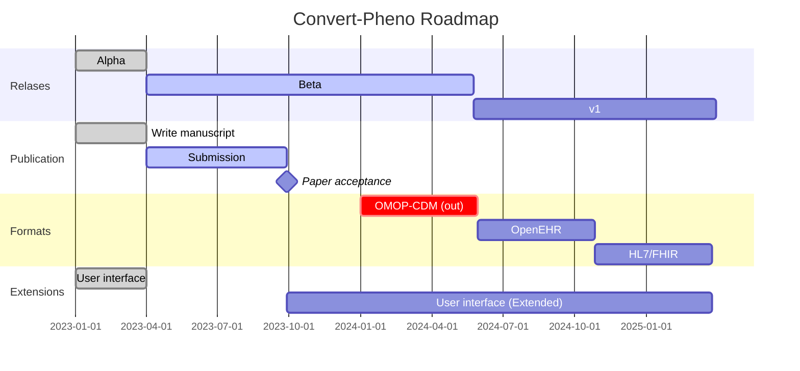

```mermaid
  gantt
    title Convert-Pheno Roadmap
    dateFormat  YYYY-MM-DD

    section Relases
    Alpha                     :done,      r1, 2023-01-01, 90d
    Beta                      :active,    r2, after m1, 420d
    v1                        :           r3, after r2, 310d

    section Publication
    Write manuscript          :done,      m1, 2023-01-01, 90d
    Submission                :active,    m2, after m1, 180d
    Paper acceptance          :milestone, after m2, 0d

    section Formats
    OMOP-CDM (out)  :crit, f1, 2024-01-01, 150d
    OpenEHR         :      f2, after f1, 150d
    HL7/FHIR        :      f3, after f2, 150d

    section Extensions
    User interface            :done,   e1, 2023-01-01, 90d
    User interface (Extended) :        after m2, 545d
```

##### last change 2023-09-06 by Manuel Rueda [:fontawesome-brands-github:](https://github.com/mrueda)
