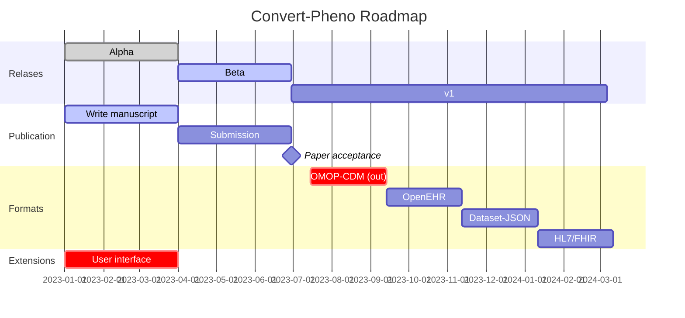

```mermaid
  gantt
    title Convert-Pheno Roadmap
    dateFormat  YYYY-MM-DD

    section Relases
    Alpha                     :done,      r1, 2023-01-01, 90d
    Beta                      :active,    r2, after r1, 90d
    v1                        :           r3, after r2, 250d

    section Publication
    Write manuscript          :active,     m1, 2023-01-01, 90d
    Submission                :            m2, after m1, 90d
    Paper acceptance          :milestone, after m2, 0d

    section Formats
    OMOP-CDM (out)  :crit, f1, 2023-07-15, 60d
    OpenEHR         :      f2, after f1, 60d
    Dataset-JSON    :      f3, after f2, 60d
    HL7/FHIR        :      f4, after f3, 60d

    section Extensions
    User interface  :crit, e1, 2023-01-01, 90d
```

##### last change 2023-01-05 by Manuel Rueda [:fontawesome-brands-github:](https://github.com/mrueda)
