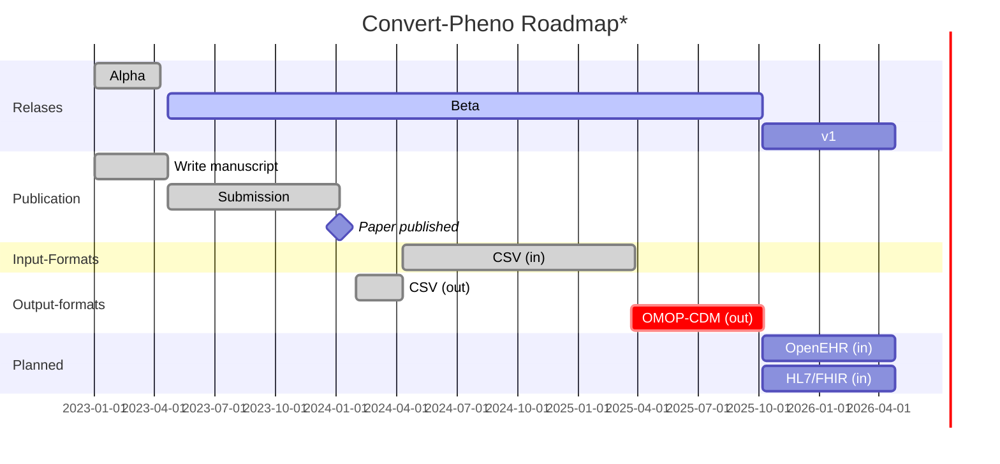

```mermaid
  gantt
    title Convert-Pheno Roadmap*
    dateFormat  YYYY-MM-DD

    section Relases
    Alpha                     :done,      r1, 2023-01-01, 100d
    Beta                      :active,    r2, after m1, 900d
    v1                        :           r3, after r2, 200d

    section Publication
    Write manuscript          :done,      m1, 2023-01-01, 110d
    Submission                :done,      m2, after m1, 260d
    Paper published           :milestone, after m2, 0d

    section Input-Formats
    CSV (in)        :done, f1, after f0,   350d

    section Output-formats
    CSV (out)       :done, f0, 2024-02-01, 70d
    OMOP-CDM (out)  :crit,     f2, 2025-03-22, 200d

    section Planned
    OpenEHR (in)    :          f3, after r2,   200d
    HL7/FHIR (in)   :          f4, after r2,   200d
```

`*The roadmap is subject to revisions and may evolve over time`

##### last change 2024-11-28 by Manuel Rueda [:fontawesome-brands-github:](https://github.com/mrueda)
