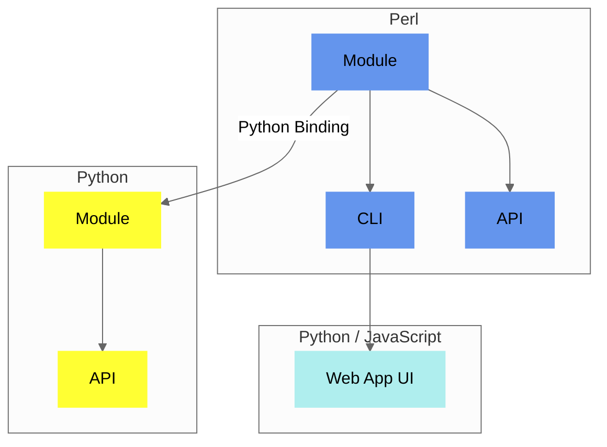

## Components

`Convert-Pheno` is a versatile **toolkit** composed of **multiple components**. At its core is a [Perl module](https://metacpan.org/pod/Convert%3A%3APheno)  that functions as a node for both the [command-line interface](use-as-a-command-line-interface.md) and the [API](use-as-an-api.md). The Perl module can be used in Python with the included Python Binding that works _out-of-the-box_ with the [containerized version](https://github.com/CNAG-Biomedical-Informatics/convert-pheno#containerized-recommended-method). The [Web App](https://cnag-biomedical-informatics.github.io/convert-pheno-ui) is built on top of the [command-line interface](use-as-a-command-line-interface.md).

<figcaption>Diagram showing Convert-Pheno implementation</figcaption>

!!! Tip "Which one should I use?"
    You can start by playing with data in the [Web App UI Playground](https://convert-pheno.cnag.cat) and when ready you can use the [CLI](use-as-a-command-line-interface.md).

## Software architecture

The [core module](https://metacpan.org/pod/Convert::Pheno) is divided into several components. Within the package `Convert::Pheno`, the class initialization is conducted and it utilizes the [Moo](https://metacpan.org/pod/Moo) module alongside [Types::Standard](https://metacpan.org/pod/Types::Standard) for data validation. Then, method chosen by the user (e.g., `pxf2bff`) is executed, and the data is forwarded to [independent modules]https://github.com/CNAG-Biomedical-Informatics/convert-pheno/tree/main/lib/Convert/Pheno), each designed for a specific input format.

Initially, our aspiration was to employ configuration files, rather than hardcoded solutions, to guide the mapping process. However, given the intricate nested nature of the data structures, we soon realized this approach wasn't viable. Consequently, we opted for hardcoded mappings. It's worth noting, though, that conversions for [REDCap](redcap.md) and [CDISC-ODM](cdisc-odm.md) still need a configuration file.

!!! Question "Why Perl?"
    The choice of Perl as a language is attributed to its inherent **speed in text processing** and its use of **sigils to distinguish data types** within intricate data structures.

## Implementing a new conversion

To make a new conversion, the first big step is to **match the variables** to the target format. At the time of writting this (Summer-2023) the mapping is still performed by human brains :cold_sweat:.

In the next section, we're exposing the mapping tables for a few reasons:

1. It's a quick way to help out the community.
2. Experts can check it out and suggest changes without digging into all the code.
3. If you want to chip in and create a new conversion, you can start by making a mapping table. 

Transforming mapping tables into code tends to be simpler when all data can be accommodated in RAM memory. Although developing a mapping for a brand-new format can be challenging, adjusting or amending properties within an existing term is relatively straightforward.

Please note that accurately mapping, even between two standards, is a substantial undertaking. While we possess expertise in certain areas, we certainly don't claim mastery in all. We sincerely **welcome** any **suggestions** or feedback. 

!!! Note "BFF and PXF community alignment"
    Regarding the interconversion between BFF and PXF, **our anticipation is that the respective communities will merge the two standards over time**. Currently, we are prioritizing terms that, in our assessment, hold the most significance. The overarching objective is that Beacon v2 Models will increasingly align with Phenopackets, streamlining the conversion process in the future.

