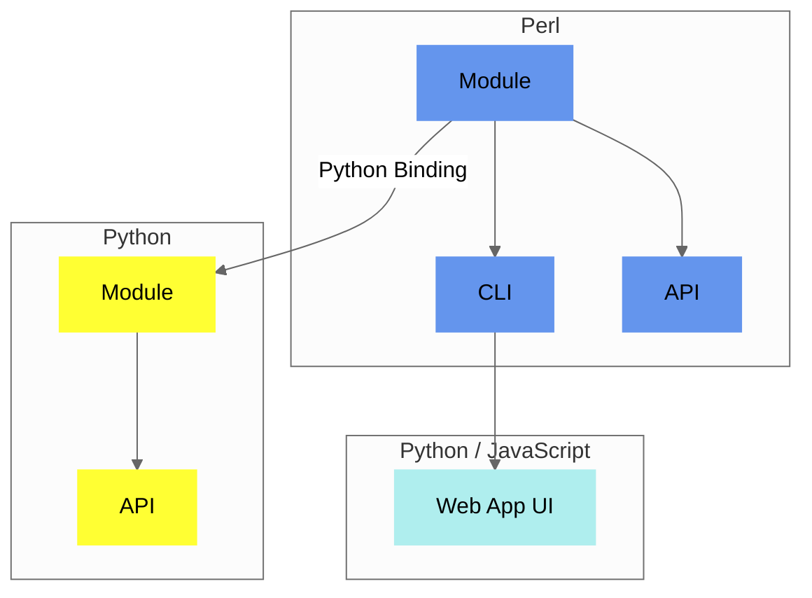

## Components

`Convert-Pheno` is a versatile **toolkit** composed of **multiple components**. At its core is a [Perl module](https://metacpan.org/pod/Convert%3A%3APheno) that functions as a node for both the [command-line interface](use-as-a-command-line-interface.md) and the [API](use-as-an-api.md). The Perl module can be used in Python with the included Python Binding that works _out-of-the-box_ with the [containerized version](https://github.com/CNAG-Biomedical-Informatics/convert-pheno#containerized-recommended-method). The [Web App](https://cnag-biomedical-informatics.github.io/convert-pheno-ui) is built on top of the [command-line interface](use-as-a-command-line-interface.md).

<figcaption>Diagram showing Convert-Pheno implementation</figcaption>

!!! Tip "Which one should I use?"
    Most users find the [CLI](use-as-a-command-line-interface.md) suitable for their needs. Begin by experimenting with the data in the [Web App UI Playground](https://convert-pheno.cnag.cat).

    Power users may want to check the [module](use-as-a-module.md) or the [API](use-as-an-api.md) version. 

## Software architecture

The [core module](https://metacpan.org/pod/Convert::Pheno) is divided into various sub-modules. The main package, `Convert::Pheno`, handles class initialization and employs the [Moo](https://metacpan.org/pod/Moo) module along with [Types::Standard](https://metacpan.org/pod/Types::Standard) for data validation. After validation, the user-selected method (e.g., `pxf2bff`) is executed, directing the data to the respective [independent modules](https://github.com/CNAG-Biomedical-Informatics/convert-pheno/tree/main/lib/Convert/Pheno), each tailored for converting a specific input format.

??? Question "Why Perl?"
    The choice of Perl as a language is due to its inherent **speed in text processing** and its use of **sigils to distinguish data types** within intricate data structures.
