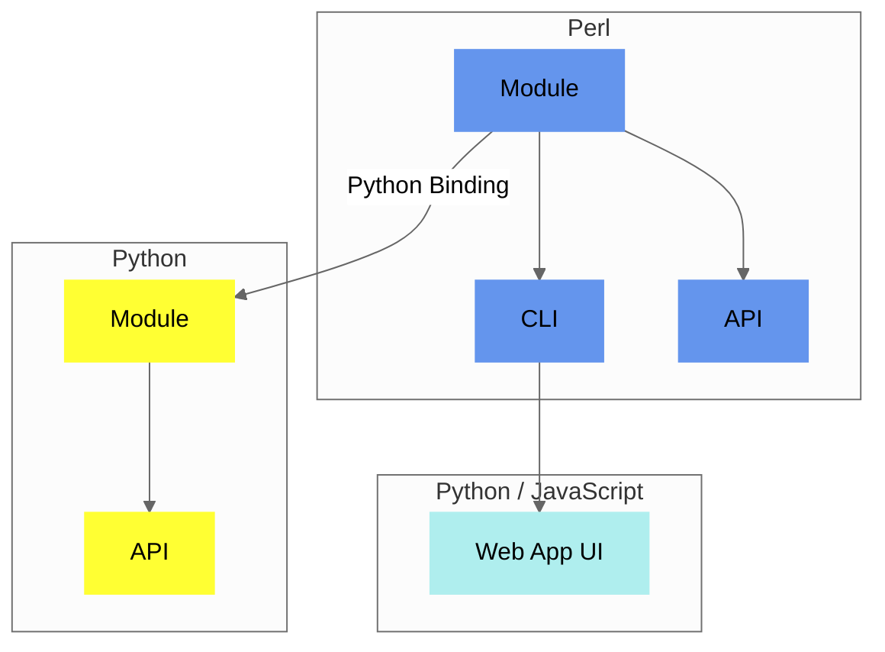

## Components

`Convert-Pheno` is a versatile **toolkit** composed of **multiple components**. At its core is a [Perl module](https://metacpan.org/pod/Convert%3A%3APheno)  that functions as a node for both the [command-line interface](use-as-a-command-line-interface.md) and the [API](use-as-an-api.md). The Perl module can be used in Python with the included Python Binding that works _out-of-the-box_ with the [containerized version](https://github.com/CNAG-Biomedical-Informatics/convert-pheno#containerized-recommended-method). The [Web App](https://cnag-biomedical-informatics.github.io/convert-pheno-ui) is built on top of the [command-line interface](use-as-a-command-line-interface.md).

<figcaption>Diagram showing Convert-Pheno implementation</figcaption>

!!! Tip "Which one should I use?"
    You can start by playing with data in the [Web App UI Playground](https://convert-pheno.cnag.cat) and when ready you can use the [CLI](use-as-a-command-line-interface.md).

## Software architecture

The [core module](https://metacpan.org/pod/Convert::Pheno) is divided into various sub-modules. The main package, `Convert::Pheno`, handles class initialization and employs the [Moo](https://metacpan.org/pod/Moo) module along with [Types::Standard](https://metacpan.org/pod/Types::Standard) for data validation. After validation, the user-selected method (e.g., `pxf2bff`) is executed, directing the data to the respective [independent modules](https://github.com/CNAG-Biomedical-Informatics/convert-pheno/tree/main/lib/Convert/Pheno), each tailored for converting a specific input format.

!!! Question "Why Perl?"
    The choice of Perl as a language is attributed to its inherent **speed in text processing** and its use of **sigils to distinguish data types** within intricate data structures.

## Implementing a new conversion

When creating a new conversion between two data models, the first step is to **match the variables** between the two data schemas. At the time of writting this (Sep-2023) the mapping of variables is still performed **manually** by human brains :cold_sweat:.

!!! Info "Mapping strategy: External or hard-coded?"
    Our initial approach leaned towards utilizing configuration files to steer the mapping process, as opposed to resorting to hardcoded solutions. However, we encountered challenges due to the complex, nested nature of the data structures, which rendered this strategy unfeasible. As a result, we chose to implement hardcoded mappings. Nevertheless, it is important to highlight that the conversions for [REDCap](redcap.md) and [CDISC-ODM](cdisc-odm.md) continue to require a configuration file.

### Mapping tables

In the **Mapping tables** section (accessible via the 'Technical Details' tab on the left navigation bar), we outline the equivalencies between different schemas. These tables fulfill several purposes:

1. It's a quick way to help out the _Health Data_ community.
2. Experts can check it out and suggest changes without digging into all the code.
3. If you want to chip in and create a new conversion, you can start by making a mapping table. 

### From mapping to code

While creating the code for a new format can be challenging, modifying properties in an existing one is much easier. The whole process is simpler when all the data fits in the RAM memory. Feel free to reach us should you plan to contribute.

!!! Warning "Notice"
    Please note that accurately mapping, even between two standards, is a substantial undertaking. While we possess expertise in certain areas, we certainly don't claim mastery in all :pray:. We sincerely **welcome** any **suggestions** or feedback.
