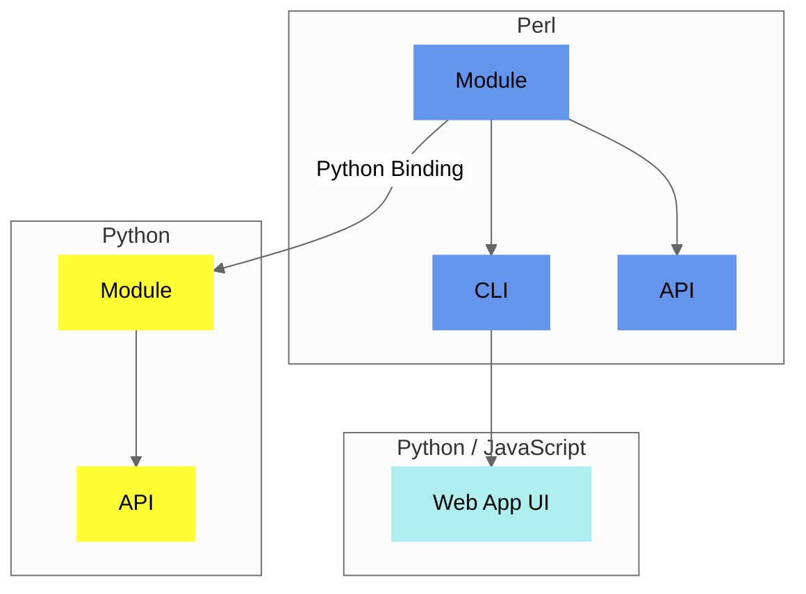

## Components

`Convert-Pheno` is a **toolkit** composed of several interfaces around the same Perl core. At the center is the [Perl module](https://metacpan.org/pod/Convert%3A%3APheno), which is used by the [command-line interface](use-as-a-command-line-interface.md) and by the [API](use-as-an-api.md). A Python interoperability layer is also included in the repository, but the conversion logic itself remains in Perl. The [Web App](https://cnag-biomedical-informatics.github.io/convert-pheno-ui) is built on top of the [command-line interface](use-as-a-command-line-interface.md).

```mermaid
%%{init: {'theme':'neutral'}}%%
graph TB
  subgraph "Perl"
  A[Module]--> B[CLI]
  A[Module]--> C[API]
  end

  subgraph "Python / JavaScript"
  B --> D[Web App UI]
  end

  subgraph "Python"
  A --> |Python Binding| E[Module]
  E --> F[API]
  end


  style A fill: #6495ED, stroke: #6495ED
  style B fill: #6495ED, stroke: #6495ED
  style C fill: #6495ED, stroke: #6495ED
  style D fill: #AFEEEE, stroke: #AFEEEE
  style E fill: #FFFF33, stroke: #FFFF33
  style F fill: #FFFF33, stroke: #FFFF33
```
<figcaption>Diagram showing Convert-Pheno implementation</figcaption>

!!! Tip "Which one should I use?"
    Most users find the [CLI](use-as-a-command-line-interface.md) suitable for their needs. Begin by experimenting with the data in the [Web App UI Playground](https://convert-pheno.cnag.cat).

    Power users may want to check the [module](use-as-a-module.md) or the [API](use-as-an-api.md) version. 

## Software architecture

The [core module](https://metacpan.org/pod/Convert::Pheno) is divided into several sub-modules. The main package, `Convert::Pheno`, handles class initialization and employs the [Moo](https://metacpan.org/pod/Moo) module along with [Types::Standard](https://metacpan.org/pod/Types::Standard) for data validation. In architectural terms, most conversions still use `BFF` as the internal target or center model: source formats are first mapped to normalized Beacon `individuals`, and from there can continue to outputs such as `PXF` or `OMOP CDM`.

Starting with `v0.30`, the implementation also uses an explicit internal conversion context and bundle model for `BFF` output. This matters whenever the input contains information that belongs to more than one Beacon entity. `PXF` biosample data can now be emitted as first-class `biosamples`, while `datasets` and `cohorts` can be synthesized from the normalized `individuals` collection. The legacy `-obff FILE` path is still kept as a backward-compatible single-file `individuals` output mode.

After validation, the user-selected method (for example `pxf2bff`) is executed, directing the data to the respective [independent modules](https://github.com/CNAG-Biomedical-Informatics/convert-pheno/tree/main/lib/Convert/Pheno), each tailored for converting a specific input format.

??? Question "Why Perl?"
    The choice of Perl as a language is due to its inherent **speed in text processing** and its use of **sigils to distinguish data types** within intricate data structures.
