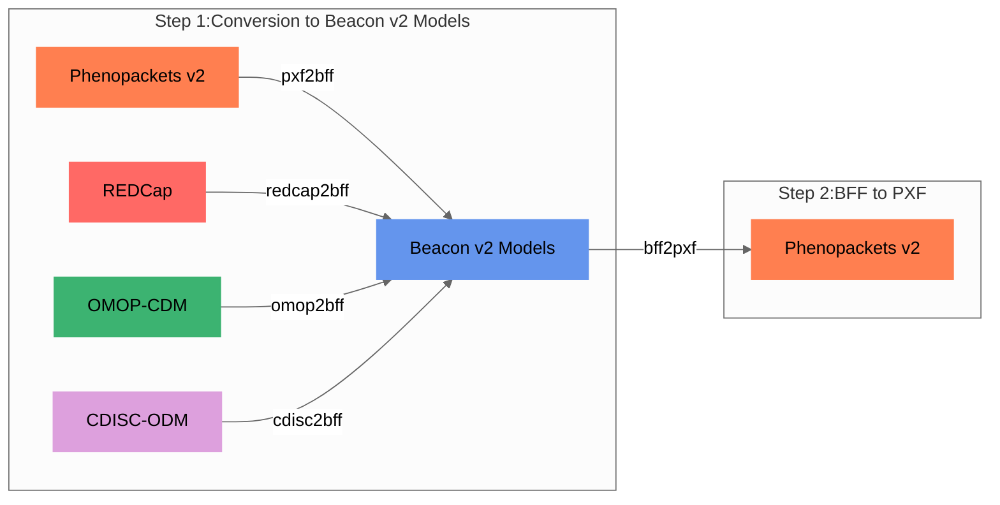

## Step 1: Conversion to the target model

Internally, all models are mapped to the [Beacon v2 Models](bff.md).

<figcaption>Convert-Pheno internal mapping steps</figcaption>

!!! Question "Why use Beacon v2 as target model?"
    * **JSON Schema Utilization:** Beacon v2 employs [JSON Schema](https://github.com/ga4gh-beacon/beacon-v2/tree/main/models) for model content definition, facilitating transparency and accessibility in a collaborative environment compared to Phenopackets' Protobuf usage.
    * **Accommodation of Additional Properties:** The Beacon v2 Models schema permits additional properties, enhancing adaptability and enabling near-lossless conversion, especially when using JSON in non-relational databases.
    * **Beacon v2 API Compatibility:** The BFF is directly compatible with the Beacon v2 API ecosystem, a feature not available in Phenopackets without additional mapping.
    * **Expansion Possibility:** Being based at CNAG, a genomics institution, the potential to extend Convert-Pheno's mapping to encompass other Beacon v2 entities was a significant consideration.
    * **Overlap with Phenopackets v2:** Despite minor differences in nomenclature or hierarchy, many essential terms remain identical, encouraging interoperability.

### Lossless or lossy conversion?

During the conversion process, handling variables that **cannot be directly mapped** can result in one of two scenarios:

1. If the target format accommodates extra properties in a given term (BFF does), unmapped variables find a place under the `_info` property. This is a usual occurrence in conversions from OMOP-CDM to BFF.
2. When a variable corresponds with other entities in the Beacon v2 Models, it gets stored within the `info` term of BFF. For instance, `biosamples` from PXF files are housed in BFF `info` under `info.phenopacket.biosamples`.

### Ontology preservation

One of the advantages of **Beacon/Phenopackets v2** is that they **do not prescribe the use of specific ontologies**, thus allowing us to retain the original ontologies, except to fill in missing terms in required fields.

!!! Question "Which ontologies are supported?"
     
    If the input files contain ontologies, the **ontologies will be preserved** and remain intact after the conversion process, except for:
     
    * _Beacon v2 Models_ and _Phenopackets v2_: the property `sex` is converted to [NCI Thesaurus](https://ncithesaurus.nci.nih.gov/ncitbrowser).
    * _OMOP-CDM_: the properties `sex`, `ethnicity`, and `geographicOrigin` are converted to [NCI Thesaurus](https://ncithesaurus.nci.nih.gov/ncitbrowser).
    
    |                | REDCap      | CDISC-ODM  | OMOP-CDM | Phenopackets v2| Beacon v2 Models |
    | -----------    | ----------- | ---------- | -------  | -------------- | -----------------|
    | Data mapping   | ✓ |  ✓ | ✓ | ✓ | ✓ |
    | Add ontologies | ✓ |  ✓ | `--ohdsi-db` |     |                  |
   
    For _REDCap_ and _CDISC-ODM_ we support:
  
    * [Athena-OHDSI](https://athena.ohdsi.org/search-terms/start) standardized vocabulary, which includes multiple ontologies, such as _SNOMED, RxNorm or LOINC_
    * [NCI Thesaurus](https://ncithesaurus.nci.nih.gov/ncitbrowser)
    * [ICD-10](https://icd.who.int/browse10)
    * [CDISC](https://www.cdisc.org/standards/terminology/controlled-terminology) (Study Data Tabulation Model Terminology)
    * [OMIM](https://www.omim.org/) Online Mendelian Inheritance in Man
    * [HPO](https://hpo.jax.org/app) Human Phenotype Ontology (Note that prefixes are `HP:`, without the `O`)

    See an example of how the **ontology similarity search** it's performed in the [REDCap tutorial](tutorial.md##creating-a-mapping-file).

## Step 2: Conversion to the final model

If the output is set to [Phenopackets v2](pheonpacket.md) then a second step (`bff2pxf`) is performed (see diagram above).

!!! Tip "BFF and PXF community alignment"
    Currently, we are prioritizing the mapping of terms that, in our assessment, hold the most significance. Our hope is that Beacon v2 Models will increasingly align with Phenopackets v2, streamlining the conversion process in the future.
