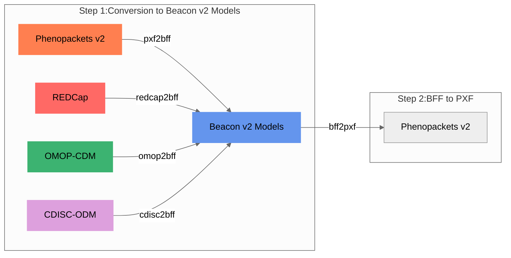

Internally, all models are mapped to the [Beacon v2 Models](bff.md). If the output is set to [Phenopackets v2](pheonpacket.md) then a second step (`bff2pxf`) is performed (see diagram below).

!!! Hint "Why use Beacon v2 as target model?"
    The reason for selecting Beacon v2 Model as the target for the conversion is its **schema flexibility**, which allows for the inclusion of variables that may not be present in the original schema definition. In contrast, Phenopackets v2 has stricter schema requirements. This flexibility offered by Beacon v2 schemas enables us to handle a wider range of phenotypic data and accommodate **additional variables**, enhancing the utility and applicability of our tool.

<figcaption>Convert-Pheno internal mapping steps</figcaption>

!!! Question "How are variables that cannot be mapped handled during the conversion process?"

    During the conversion process, handling variables that **cannot be directly mapped** can result in one of two scenarios:

    1. If the target format accommodates extra properties in a given term (BFF does), unmapped variables find a place under the `_info` property. This is a usual occurrence in conversions from OMOP-CDM to BFF.
   
    2. When a variable corresponds with other entities in the Beacon v2 Models, it gets stored within the `info` term of BFF. For instance, `biosamples` from PXF files are housed in BFF `info` under `info.phenopacket.biosamples`.
