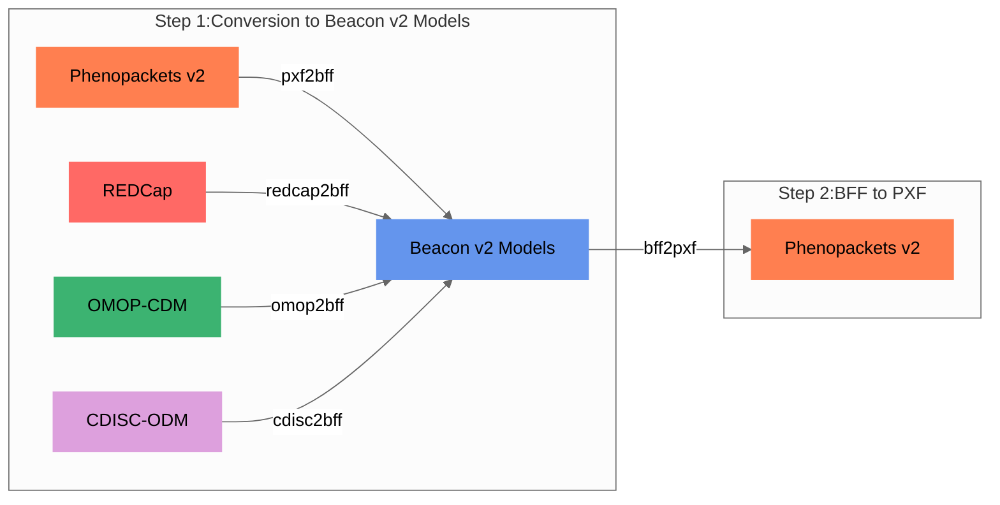

## Step 1: Conversion to the target model

Internally, all models are mapped to the [Beacon v2 Models](bff.md).


<figcaption>Convert-Pheno internal mapping steps</figcaption>

??? Question "Why use Beacon v2 as target model?"
    * **JSON Schema Utilization:** Beacon v2 employs [JSON Schema](https://github.com/ga4gh-beacon/beacon-v2/tree/main/models) for model content definition, facilitating transparency and accessibility in a collaborative environment compared to Phenopackets' Protobuf usage.
    * **Accommodation of Additional Properties:** The Beacon v2 Models schema permits additional properties, enhancing adaptability and enabling near-lossless conversion, especially when using JSON in non-relational databases.
    * **Beacon v2 API Compatibility:** The BFF is directly compatible with the Beacon v2 API ecosystem, a feature not available in Phenopackets without additional mapping.
    * **Expansion Possibility:** Being based at CNAG, a genomics institution, the potential to extend Convert-Pheno's mapping to encompass other Beacon v2 entities was a significant consideration.
    * **Overlap with Phenopackets v2:** Despite minor differences in nomenclature or hierarchy, many essential terms remain identical, encouraging interoperability.


### Schema mapping

When starting a new conversion between two data models, the first step is to **map variables** between the two data schemas. At the time of writting this (Sep-2023) the mapping of variables is still performed **manually** by human brains :cold_sweat:.

??? Info "Mapping strategy: External or hardcoded?"
    In the early stages of development, we explored the possibility of employing configuration files to guide the mapping process as an alternative to hardcoded solutions. However, JSON data structures' complexity, mainly due to nesting, made this approach impractical for most scenarios, except for [REDCap](redcap.md) and [CDISC-ODM](cdisc-odm.md) data, which are mapped to Beacon v2 Models via configuration files.

In the **Mapping tables** section (accessible via the 'Technical Details' tab on the left navigation bar), we outline the equivalencies between different schemas. These tables fulfill several purposes:

1. It's a quick way to help out the _Health Data_ community.
2. Experts can check it out and suggest changes without digging into all the code.
3. If you want to chip in and create a new conversion, you can start by making a mapping table.

!!! Bug "Notice"
    Please note that accurately mapping, even between two standards, is a substantial undertaking. While we possess expertise in certain areas, we certainly don't claim mastery in all :pray:. We sincerely welcome any **suggestions** or feedback.

### From table mappings to code

The tables function as a reference for implementing the source code of Convert-Pheno. For each format conversion, there is a dedicated Perl [submodule](https://github.com/CNAG-Biomedical-Informatics/convert-pheno/tree/main/lib/Convert/Pheno).

!!! Info "Contributing"
    While creating the code for a new format can be challenging, modifying properties in an existing one is much easier. Feel free to [reach us](https://github.com/CNAG-Biomedical-Informatics/convert-pheno/issues) should you plan to contribute.

### Lossless or lossy conversion?

When converting data from one data standard to another, it is important to consider the possibility of losing information due to differences in schema and field mapping. To mitigate this, we aimed for a **lossless** conversion by incorporating non-mappable variables as `additionalProperties` within the Beacon v2 Models [schema](https://docs.genomebeacons.org/schemas-md/individuals_defaultSchema/). This allows users to access the original variables and their values through database queries, especially when using non-relational databases like MongoDB. 

During the conversion process, handling variables that cannot be directly mapped can result in one of two scenarios:

=== "Unmappable variables"

    Often, the input data model has variables that do not directly map to the target but are still useful to retain in the output format. If the target format allows for extra properties in a given term (as BFF does), these original variables are stored under the `_info` property (or `_` + ‘property name’). This commonly happens in conversions from OMOP-CDM to BFF. 

    Example extracted from `omop2bff` [conversion](https://github.com/CNAG-Biomedical-Informatics/convert-pheno/blob/main/t/omop2bff/out/individuals.json):
     
    ```json
    "interventionsOrProcedures" : [
           {
              "_info" : {
                 "PROCEDURE_OCCURRENCE" : {
                    "OMOP_columns" : {
                       "modifier_concept_id" : 0,
                       "modifier_source_value" : null,
                       "person_id" : 2,
                       "procedure_concept_id" : 4163872,
                       "procedure_date" : "1955-10-22",
                       "procedure_datetime" : "1955-10-22 00:00:00",
                       "procedure_occurrence_id" : 6,
                       "procedure_source_concept_id" : 4163872,
                       "procedure_source_value" : 399208008,
                       "procedure_type_concept_id" : 38000275,
                       "provider_id" : "\\N",
                       "quantity" : "\\N", 
                       "visit_detail_id" : 0,
                       "visit_occurrence_id" : 103
                    }
                 }
              },
              "ageAtProcedure" : {
                 "age" : {
                    "iso8601duration" : "35Y"
                 }
              },
              "dateOfProcedure" : "1955-10-22",
              "procedureCode" : {
                 "id" : "SNOMED:399208008",
                 "label" : "Plain chest X-ray"
              }
           }
     ]
    ```

    Example extracted from `redcap2bff` [conversion](https://github.com/CNAG-Biomedical-Informatics/convert-pheno/blob/main/t/redcap2bff/out/individuals.json):

    ```json
    "treatments" : [
           {
              "_info" : {
                 "dose" : null,
                 "drug" : "budesonide",
                 "drug_name" : "budesonide",
                 "duration" : null,
                 "field" : "budesonide_oral_status",
                 "route" : "oral",
                 "start" : null,
                 "status" : "never treated",
                 "value" : 1
              },
              "doseIntervals" : [],
              "routeOfAdministration" : {
                 "id" : "NCIT:C38288",
                 "label" : "Oral Route of Administration"
              },
              "treatmentCode" : {
                 "id" : "NCIT:C1027",
                 "label" : "Budesonide"
              }
           }
    ]
    ```

    Example of longitudinal data stored under `_visit` in a `omop2bff` [conversion](https://github.com/CNAG-Biomedical-Informatics/convert-pheno/blob/main/t/omop2bff/out/individuals.json):

    ```json
    "_visit" : {
            "_info" : {
               "VISIT_OCCURENCE" : {
                  "OMOP_columns" : {
                     "admitting_source_concept_id" : 0,
                     "admitting_source_value" : null,
                     "care_site_id" : "\\N",
                     "discharge_to_concept_id" : 0,
                     "discharge_to_source_value" : null,
                     "person_id" : 3,
                     "preceding_visit_occurrence_id" : 347,
                     "provider_id" : "\\N",
                     "visit_concept_id" : 9201,
                     "visit_end_date" : "1972-12-21",
                     "visit_end_datetime" : "1972-12-21 00:00:00",
                     "visit_occurrence_id" : 312,
                     "visit_source_concept_id" : 0,
                     "visit_source_value" : "5d035dd1-30d9-4389-b94c-64947bf1f18c",
                     "visit_start_date" : "1972-12-20",
                     "visit_start_datetime" : "1972-12-20 00:00:00",
                     "visit_type_concept_id" : 44818517
                  }
               }
            },
            "concept" : {
               "id" : "Visit:IP",
               "label" : "Inpatient Visit"
            },
            "end_date" : "1972-12-21T00:00:00Z",
            "id" : "312",
            "occurrence_id" : 312,
            "start_date" : "1972-12-20T00:00:00Z",
            "type" : {
               "id" : "Visit Type:OMOP4822465",
               "label" : "Visit derived from encounter on claim"
            }
         },
         "featureType" : {
            "id" : "SNOMED:428251008",
            "label" : "History of appendectomy"
         },
         "onset" : {
            "iso8601duration" : "56Y"
         }
    }
    ```

=== "Match to a different entity"

    When a variable corresponds to other entities in [Beacon v2 Models](https://github.com/ga4gh-beacon/beacon-v2), it is stored within the `info` term of the [individuals](https://docs.genomebeacons.org/schemas-md/individuals_defaultSchema/) entity. For instance, a `PXF` file may contain the [biosamples](https://phenopacket-schema.readthedocs.io/en/latest/phenopacket.html) property, which doesn't find a direct match in the [individuals](https://docs.genomebeacons.org/schemas-md/individuals_defaultSchema/) entity as it corresponds to the [biosamples](https://docs.genomebeacons.org/schemas-md/biosamples_defaultSchema/) entity in Beacon v2 Models. To ensure the retention of this information, we place it under `info.phenopacket.biosamples`.
     
    Example extracted from `pxf2bff` [conversion](https://github.com/CNAG-Biomedical-Informatics/convert-pheno/blob/main/t/pxf2bff/out/individuals.json):
     
    ```json
    "info" : {
              "phenopacket" : {
                 "biosamples" : [
                    {
                       "id" : "biosample.1",
                       "phenotypicFeatures" : [
                          {
                             "excluded" : false,
                             "type" : {
                                "id" : "HP:0003798",
                                "label" : "Nemaline bodies"
                             }
                          }
                       ],
                       "procedure" : {
                          "bodySite" : {
                             "id" : "UBERON:0002378",
                             "label" : "muscle of abdomen"
                          },
                          "code" : {
                             "id" : "NCIT:C51895",
                             "label" : "Muscle Biopsy"
                          },
                          "performed" : {
                             "age" : {
                                "iso8601duration" : "P1D"
                             }
                          }
                       },
                       "sampledTissue" : {
                          "id" : "UBERON:0002378",
                          "label" : "muscle of abdomen"
                       }
                    }
                 ]
           }
    }
    ```

### Preservation and augmentation of ontologies

One of the advantages of **Beacon/Phenopackets v2** is that they **do not prescribe the use of specific ontologies**, thus allowing us to retain the original ontologies, except to fill in missing terms in required fields.

???+ Question "Which ontologies are supported?"
     
    If the input files contain ontologies, the **ontologies will be preserved** and remain intact after the conversion process, except for:
     
    * _Beacon v2 Models_ and _Phenopackets v2_: the property `sex` is converted to [NCI Thesaurus](https://ncithesaurus.nci.nih.gov/ncitbrowser).
    * _OMOP-CDM_: the properties `sex`, `ethnicity`, and `geographicOrigin` are converted to [NCI Thesaurus](https://ncithesaurus.nci.nih.gov/ncitbrowser).
    
    |                | REDCap      | CDISC-ODM  | OMOP-CDM | Phenopackets v2| Beacon v2 Models |
    | -----------    | ----------- | ---------- | -------  | -------------- | -----------------|
    | Data mapping   | ✓ |  ✓ | ✓ | ✓ | ✓ |
    | Add ontologies | ✓ |  ✓ | `--ohdsi-db` |     |                  |
   
    For _REDCap_ and _CDISC-ODM_ we support:
  
    * [Athena-OHDSI](https://athena.ohdsi.org/search-terms/start) standardized vocabulary, which includes multiple ontologies, such as _SNOMED, RxNorm or LOINC_
    * [NCI Thesaurus](https://ncithesaurus.nci.nih.gov/ncitbrowser)
    * [ICD-10](https://icd.who.int/browse10)
    * [CDISC](https://www.cdisc.org/standards/terminology/controlled-terminology) (Study Data Tabulation Model Terminology)
    * [OMIM](https://www.omim.org/) Online Mendelian Inheritance in Man
    * [HPO](https://hpo.jax.org/app) Human Phenotype Ontology (Note that prefixes are `HP:`, without the `O`)

    See an example of how the **ontology similarity search** it's performed in the [REDCap tutorial](tutorial.md##creating-a-mapping-file).

## Step 2: Conversion to the final model

If the output is set to [Phenopackets v2](pxf.md) then a second step (`bff2pxf`) is performed (see diagram above).

??? Warning "BFF and PXF community alignment"
    At present, we have prioritized mapping the terms that we deem most critical in facilitating **basic semantic interoperability**. We anticipate that Beacon v2 Models will become more aligned with Phenopackets v2, which will simplify the conversion process in future updates. We aim to refine the mappings in future iterations, with the community providing a wider range of case studies.
