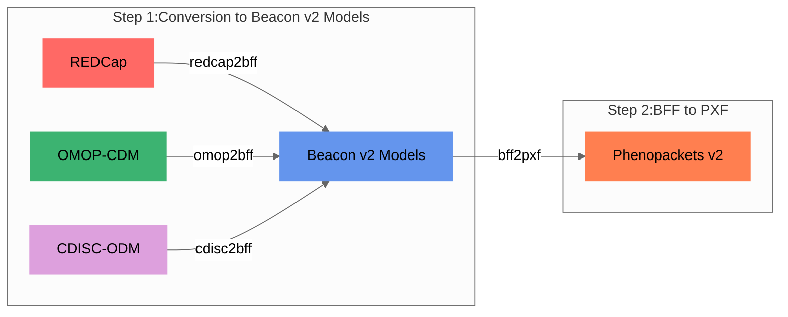

Internally, all models are mapped to the [Beacon v2 Models](bff.md). 

!!! Hint "Why use Beacon v2 as target model?"
    The reason for selecting Beacon v2 Model as the target for the conversion is its **schema flexibility**, which allows for the inclusion of variables that may not be present in the original schema definition. In contrast, Phenopackets v2 has stricter schema requirements. This flexibility offered by Beacon v2 schemas enables us to handle a wider range of phenotypic data and accommodate **additional variables**, enhancing the utility and applicability of our tool.

<figcaption>Convert-Pheno internal mapping steps</figcaption>

!!! Question "How are variables that cannot be mapped handled during the conversion process?"

    During the conversion process, when encountering variables that **cannot be directly mapped** to the target standard, two situations may arise. In the first situation, if the target format allows for additional terms (e.g., BFF), the variable will be stored under the `_info` property. This commonly occurs when converting from OMOP-CDM to BFFs. In the second situation, if the variable maps to other entities within Beacon v2 Models, it will be stored within BFF's `info` term. An example of this is the storage of `biosampless` from PXF files into BFF `info` (`info.phenopacket.biosamples`).

