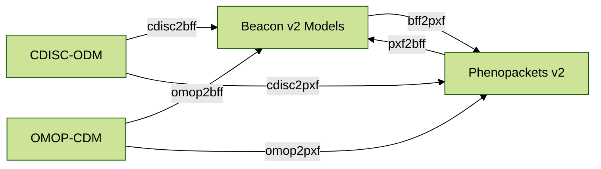

# Supported formats

<figure markdown>

<!--     datasets o-- runs : 1..n
    datasets o-- analyses : 1..n
    datasets o-- biosamples : 1..n
    datasets o-- individuals : 1..n
 -->

  <figcaption>Convert-Pheno supported data conversions</figcaption>
</figure>

=== "Input formats:"

    * [Beacon v2 Models (JSON)](bff.md)
    * [Phenopacket v2 (JSON)](pxf.md)
    * [OMOP-CDM (SQL export / CSV)](omop-cdm.md)
    * [REDCap exports (CSV)](redcap.md)
    * [CDISC-ODM v1 (XML)](cdisc.md)

=== "Output formats (Jan-2023):"

    * [Beacon v2 Models (JSON](bff.md)
    * [Phenopacket v2 (JSON)](pxf.md)
