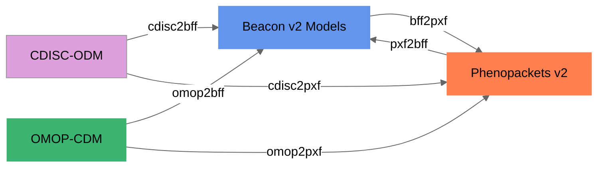

# Supported formats

<figure markdown>

  <figcaption>Convert-Pheno supported data conversions</figcaption>
</figure>

=== "Input formats:"

    * [Beacon v2 Models (JSON | YAML)](bff.md)
    * [Phenopacket v2 (JSON | YAML)](pxf.md)
    * [OMOP-CDM (SQL export | CSV)](omop-cdm.md)
    * [REDCap exports (CSV)](redcap.md)
    * [CDISC-ODM v1 (XML)](cdisc.md)

=== "Output formats (Jan-2023):"

    * [Beacon v2 Models (JSON | YAML)](bff.md)
    * [Phenopacket v2 (JSON | YAML)](pxf.md)

    !!! Question "Why start with these two?"
        [Beacon v2](https://docs.genomebeacons.org) and [Phenopackets v2](https://phenopacket-schema.readthedocs.io/en/latest) are data exchange standards from the [G4AGH](https://www.ga4gh.org).

