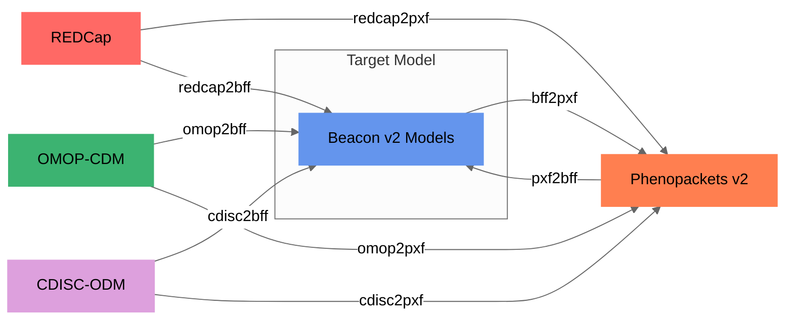

# Supported formats

<figcaption>Convert-Pheno supported data conversions</figcaption>

=== "Input formats:"

    * [Beacon v2 Models (JSON | YAML)](bff.md)
    * [Phenopacket v2 (JSON | YAML)](pxf.md)
    * [OMOP-CDM (SQL export | CSV)](omop-cdm.md)
    * [REDCap exports (CSV)](redcap.md)
    * [CDISC-ODM v1 (XML)](cdisc-odm.md)

=== "Output formats (Jun-2023):"

    * [Beacon v2 Models (JSON | YAML)](bff.md)
    * [Phenopacket v2 (JSON | YAML)](pxf.md)

    ??? Question "Why start with these two?"
        [Beacon v2](https://docs.genomebeacons.org) and [Phenopackets v2](https://phenopacket-schema.readthedocs.io/en/latest) are data exchange standards from the [GA4GH](https://www.ga4gh.org). They:
         
        - Allow for storing both **phenotypic** and **genomic** data, a key component in today's research
        - Facilitate streamlined data representation in genomic and biomedical research environments
        - Play a central role in mapping exercises due to their structured and compact data schemas
        - Are not intended to replace or encompass FHIR and other EHR data models
        - Foster effective data sharing and integration initiatives

        Note that these output formats are **intermediate** files that reach their full potential when loaded into a database. For instance, [BFF](bff.md) can be loaded into a MongoDB database and their fields can be queried through an **API**, such as the [Beacon v2 API](https://docs.genomebeacons.org).
