# Supported formats

```mermaid
%%{init:{'theme':'neutral'}}%%
graph LR
  subgraph "🎯 Target Model"
    A[🧬 Beacon v2 Models]
  end

  A -->|bff2pxf| B[📦 Phenopackets v2]
  C[📝 REDCap] -->|redcap2pxf| B
  D[🏥 OMOP-CDM] -->|omop2bff| A
  E[📑 CDISC-ODM] -->|cdisc2bff| A
  F[📊 CSV] -->|csv2bff| A
  B -->|pxf2bff| A
  C -->|redcap2bff| A
  D -->|omop2pxf| B
  E -->|cdisc2pxf| B
  F -->|csv2pxf| B
  A -->|🧪 bff2omop| D
  F -->|🧪 csv2omop| D
  E -->|🧪 cdisc2omop| D
  C -->|🧪 redcap2omop| D
  B -->|🧪 pxf2omop| D


  style A fill:#6495ED,stroke:#6495ED
  style B fill:#FF7F50,stroke:#FF7F50
  style C fill:#FF6965,stroke:#FF6965
  style D fill:#3CB371,stroke:#3CB371
  style E fill:#DDA0DD,stroke:#DDA0DD
  style F fill:#FFFF00,stroke:#FFFF00

  %% dotted, thinner, semi‑transparent blue for the “must via BFF” shortcuts
     linkStyle 1,7,8,9,11,12,13 stroke:#0000FF,stroke-width:1px,stroke-dasharray:5 5,opacity:0.5;
```



<figcaption>Convert-Pheno supported data conversions (Apr-17-2025).<br />Note: Dotted blue lines → must go via Beacon v2 Models</figcaption>

=== "Input formats:"

    * [Beacon v2 Models (JSON | YAML)](bff.md)
    * [Phenopacket v2 (JSON | YAML)](pxf.md)
    * [OMOP-CDM (SQL export | CSV)](omop-cdm.md)
    * [🧪 REDCap exports (CSV)](redcap.md)
    * [🧪 CDISC-ODM v1 (XML)](cdisc-odm.md)
    * [🧪 CSV raw data](csv.md)

=== "Output formats:"

    ### **Main**

    * [Beacon v2 Models (JSON | YAML)](bff.md)
    * [Phenopacket v2 (JSON | YAML)](pxf.md)
    * 🧪 [OMOP CDM (CSV)](omop-cdm.md)

    ??? Question "Why GA4GH Beacon v2 and Phenopackets v2?"
        [Beacon v2 [BFF]](https://docs.genomebeacons.org) and [Phenopackets v2 [PXF]](https://phenopacket-schema.readthedocs.io/en/latest) are data exchange standards from the [GA4GH](https://www.ga4gh.org). They:
     
        - Allow for storing both **phenotypic** and **genomic** data, a key component in today's research
        - Facilitate streamlined data representation in genomic and biomedical research environments 
        - Play a central role in mapping exercises due to their structured and compact data schemas
        - Are not intended to replace other health data
        - Foster effective data sharing and integration initiatives

    ### **Additional Output Formats**
    
    Given that Beacon v2 Models and Phenopackets v2 utilize JSON to encode data in a complex tree-like structure, this format presents challenges for straightforward analytics. To mitigate this and enhance data usability, we provide options to convert from `BFF/PXF` to more analytics-friendly formats:

    - "Flattened" (a.k.a., folded) JSON or YAML with the option `--ojsonf`
    - CSV with the option `--ocsv`

    Additionally, we are working on a conversion to [JSON-LD](https://en.wikipedia.org/wiki/JSON-LD), a format that is compatible with the [RDF](https://en.wikipedia.org/wiki/Resource_Description_Framework) ecosystem, used in many healthcare-related data systems.

    - 🧪 JSON-LD (or YAML-LD) with the option `--jsonld`

    !!! Hint "Hint"
        Note that you can convert from any accepted input format to either `BFF` or `PXF`.

    ```mermaid
    %%{init: {'theme':'neutral'}}%%
    graph LR
    
      A[BFF] -->|bff2jsonf| C[JSON Flattened];
      A -->|bff2csv| D[CSV];
      A -->|bff2jsonld| E[JSON-LD];


      B[PXF] -->|pxf2jsonf| C;
      B -->|pxf2csv| D;
      B -->|pxf2jsonld| E[JSON-LD];

      style A fill: #6495ED
      style A stroke: #6495ED
      style B fill: #FF7F50
      style B stroke: #FF7F50
      style C fill: #FFFF00
      style C stroke: #FFFF00
      style D fill: #EOEOEO
      style D stroke: #EOEOEO
      style E fill: #9999FF
      style E stroke: #9999FF
    ```
    <figcaption>Convert-Pheno additional data conversions</figcaption>
