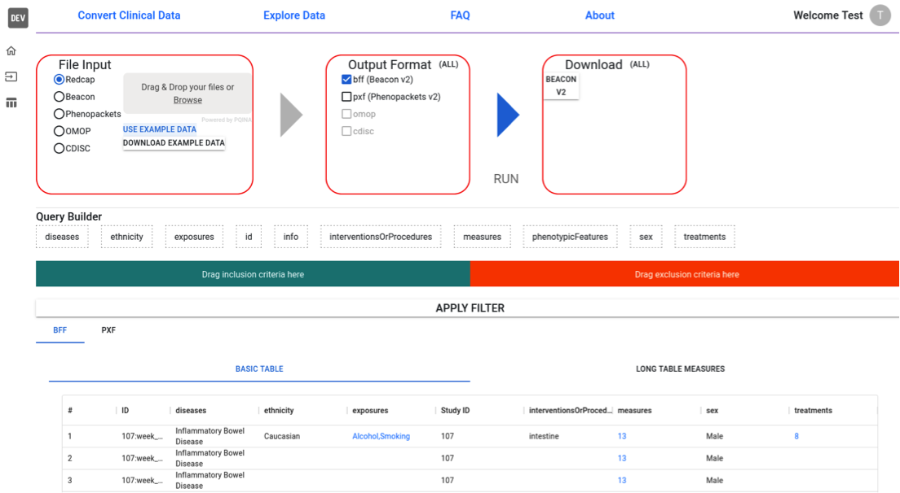

We have created a user-friendly **web application** that simplifies the process of data conversion, eliminating the need for command-line usage. The application comes with a search function and displays the data as HTML tables, and users can download their data as well.

<figure markdown>
   { width="600" }
   <figcaption>Snapshot of Convert-Pheno UI Web App</figcaption>
</figure>

!!! Hint "UI Web App playground"
    We have developed a **secure testing environment**, or playground, for the app. This environment allows users to test the app using synthetic data as well as upload their own data.

    https://convert-pheno.cnag.crg.eu

## Installation

The software is containerized. Please see the instructions [here](https://github.com/cnag-biomedical-informatics/convert-pheno-ui).
