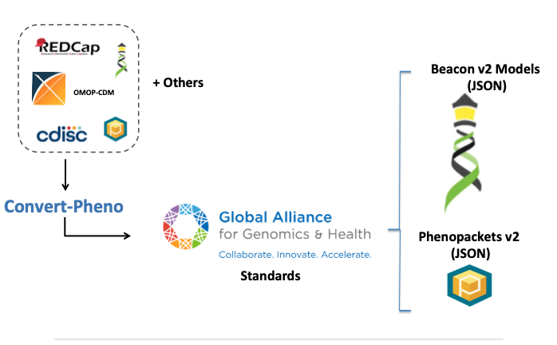

# What is Convert-Pheno?

`Convert-Pheno` is an **open-source** toolkit designed to **interconvert common phenotypic data models**, facilitating easier data sharing and integration across different standards.

<figure markdown>
 {width="500"}
 <figcaption>Convert-Pheno schematic view</figcaption>
</figure>

## Basic Usage: Command-Line Interface

Most users interact with `Convert-Pheno` via its **Command-Line Interface (CLI)**. The CLI operates directly on text files, providing straightforward input-output interaction.

## Advanced Usage: Alternative Operation Modes

`Convert-Pheno` also supports several alternative modes of operation to accommodate diverse user needs:

- **[Module](use-as-a-module.md)**: Embed `Convert-Pheno` directly into your custom scripts or automated pipelines.
- **[API Access](use-as-an-api.md)**: Programmatically access conversion functionalities through a standardized API.

## Web Application Interface

- **[Web Application Interface](https://cnag-biomedical-informatics.github.io/convert-pheno-ui)**: An intuitive and interactive web-based user interface.

## Listen to the Paper: Audio Edition

!!! Abstract "Podcast-Style Audio Format"

    Explore the key insights of this paper in audio format! Perfect for learning on the go or through immersive narration.

    <audio controls>
      <source src="../media/convert-pheno-notebook-llm.mp3" type="audio/mpeg">
      Your browser does not support the audio element.
    </audio>

    Made with [Notebook LLM](https://notebooklm.google.com)
