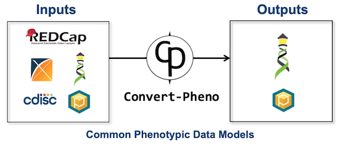

# What is Convert-Pheno?

`Convert-Pheno` is an **open-source toolkit** for converting clinical and phenotypic data between several commonly used exchange models.

<figure markdown>
 {width="500"}
 <figcaption>Convert-Pheno schematic view</figcaption>
</figure>

In practice, the project is centered on a **Perl module** and a **command-line tool** that work with text files such as:

- BFF `individuals` JSON/YAML, plus entity-aware BFF output for `biosamples`, `datasets`, and `cohorts`
- Phenopackets v2 JSON/YAML
- OMOP-CDM SQL or CSV exports
- experimental openEHR canonical JSON/YAML composition input
- REDCap CSV exports
- CDISC-ODM XML
- mapped CSV input

Internally, the toolkit uses `BFF` as its **center model** for most conversions. From there, it can emit `BFF`, `PXF`, or `OMOP CDM` output depending on the selected workflow.

The current `openEHR` path should still be treated as **experimental**. It is currently aimed at canonical composition input and `BFF` output.

## Most users should start here

For most users, the [command-line interface](use-as-a-command-line-interface.md) is the **right entry point**. It is the most direct way to run conversions on files and the interface that the rest of the project is built around.

Typical examples are:

```bash
convert-pheno -ipxf pxf.json -obff individuals.json
convert-pheno -ipxf pxf.json -obff --entities individuals biosamples datasets cohorts --out-dir out/
convert-pheno -iomop dump.sql.gz -obff individuals.json.gz --stream --ohdsi-db
```

See [Use as a command-line interface](use-as-a-command-line-interface.md) for the CLI entry points and [Usage](usage.md) for more examples.

## Other ways to use it

If you need tighter integration:

- [As a module](use-as-a-module.md): call `Convert::Pheno` from Perl code
- [As an API](use-as-an-api.md): run the lightweight HTTP API
- [Web App UI](https://cnag-biomedical-informatics.github.io/convert-pheno-ui/): inspect and try conversions interactively

## What to read next

- [Supported formats](supported-formats.md) if you want to know what can be converted
- [Download & Installation](download-and-installation.md) if you want to install it
- [Use as a command-line interface](use-as-a-command-line-interface.md) if you want to run it now
