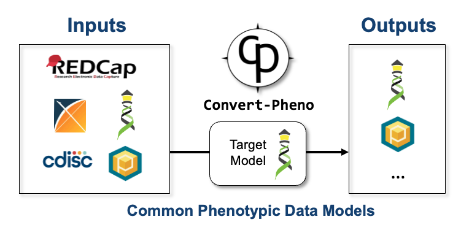

# What is Convert-Pheno?

`Convert-Pheno` is a software toolkit for the interconversion of standard data models for phenotypic data.

<figure markdown>
 {width="550"}
 <figcaption>Convert-Pheno schematic view</figcaption>
</figure>

!!! Tip "Use"

    `Convert-Pheno` can be operated as a:

    * [Command-line tool](use-as-a-command-line-tool.md)
    * [Module](use-as-a-module.md)
    * [API](use-as-an-api.md)
